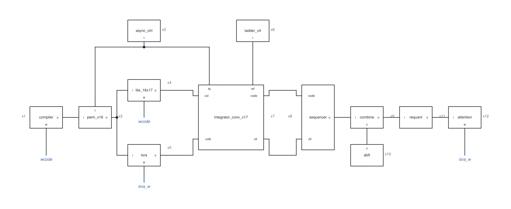

# HT-AIMC

An analog in-memory-compute (IMC) transformer accelerator. Weights stay in charge-domain
crossbar tiles, activations arrive as pulse widths, and each column converts its dot product
with an event-rate + SAR converter. A digital rail recombines the partial sums and runs
attention, and a compiler maps real GGUF models onto the tiles. A bit-true golden model checks
every stage.

**Status.** The first design was built and measured on **sky130**. Those blocks are the
calibrated anchor. The target process is now **ASAP7** (7 nm FinFET, predictive), and an
architecture search for the ASAP7 chip is in progress against
[the objective in `ARCH_METRIC.md`](docs/src/content/Project/ARCH_METRIC.md):
tok/s per 100 mm² die first, then TOPS/W, tok/W and tok/J, on Llama-3-8B shapes.

## Architecture

The sky130 chip as built: one MVM path, from the compiler through the analog macro and back
through the digital rail. Drawn with cktImg from
[`docs/architecture/blocks.spice`](docs/architecture/blocks.spice).



| Ref | Block | Where |
|---|---|---|
| x1 | Compiler: weight codes, INT8 activations | `scripts/compiler/` |
| x2 | Self-timed t_q grid and phases | `analog/async_ctrl` |
| x3 | PWM row drivers, INT8 as two 4b nibbles | `analog/pwm_driver` |
| x4 | 16 × 17 charge-domain weight tile | `analog/weight_tile` |
| x5 | Rank-1 LoRA sidecar | `analog/lora_sidecar` |
| x6 | Reference ladders (thresholds, SAR span) | `analog/rstring_ladder` |
| x7 | Column converters: integrator, event-rate coarse loop, 4b SAR | `analog/integrator_conv` |
| x8 | Conversion sequencing (tile_fsm, event_ctrl, sar_ctrl) | `digital/analogioc` |
| x9 | Nibble/slice recombination and accumulation | `digital/analogioc` |
| x10 | Checksum compare (ABFT) | `digital/analogioc` |
| x11 | Requantization and sign early exit | `digital/analogioc` |
| x12 | KV cache, QKᵀ, softmax, A·V; LoRA updates (`lora_w`) | `digital/analogioc` |

Blue labels are nets joined by name: `wcode` (compiler to tile) and `lora_w` (attention rail
back to the LoRA sidecar).

Attention projections (Q/K/V/O) and the FFN run on the tiles. The KV cache, scores, softmax and
A·V run on the digital rail ([details](docs/src/content/Project/APPLICATION_ATTENTION.md)).
Timing is self-timed, with no global analog clock. Specs and their derivation are in
[`analog/docs/architecture.md`](analog/docs/architecture.md) and
[`analog/docs/specs.py`](analog/docs/specs.py).

The baseline the IMC chip has to beat is a digital weight-stationary systolic array in
[`digital/sysreference/`](digital/sysreference), scored with the same metric.

## Components

### Analog blocks · [`analog/`](analog)

Each block has a Verilog-A model (`va/`), a netlist generator (`netlist/`) and self-checking
testbenches (`test/`) that print PASS/FAIL.

| Block | Role | Verilog-A | Netlist | Testbenches |
|---|---|:---:|:---:|:---:|
| [`weight_tile`](analog/weight_tile) | 16 × (16 + 1) charge-domain crossbar, 4b differential cap banks, checksum column | ✓ | ✓ | 12 |
| [`integrator_conv`](analog/integrator_conv) | Column converter: integrator, event-rate coarse loop, 4b SAR on the residue | ✓ | ✓ | 3 |
| [`pwm_driver`](analog/pwm_driver) | Drives the PWM envelope onto the two-phase switched-cap grid | ✓ | ✓ | 5 |
| [`async_ctrl`](analog/async_ctrl) | Self-timed sequencer and `tq_chain` t_q tap line | ✓ | ✓ | 6 |
| [`rstring_ladder`](analog/rstring_ladder) | 4b R-string: converter thresholds and SAR span | ✓ | ✓ | 4 |
| [`strongarm`](analog/strongarm) | Clocked latch comparator (coarse loop, SAR trials) | ✓ | ✓ | 4 |
| [`ota`](analog/ota) | Telescopic-cascode OTA for the column integrator | ✓ | ✓ | 8 |
| [`cmos_switch`](analog/cmos_switch) | Transmission gate: steering, resets, tap muxes | ✓ | ✓ | 4 |
| [`lora_sidecar`](analog/lora_sidecar) | Rank-1 LoRA, `B·(A·x)` summed in charge onto the tile columns | ✓ | ✓ | 4 |
| [`gain_cell_array`](analog/gain_cell_array) | 8 × 8 2T gain cells holding the LoRA A/B weights | ✓ | ✓ | 4 |
| [`write_dac`](analog/write_dac) | 4b R-string DAC that programs the gain cells | ✓ | ✓ | 4 |
| [`analogioc`](analog/analogioc) | Top-level analog macro (assembles the blocks above) | ✓ | ✓ | — |
| [`chip_supertile`](analog/chip_supertile) | Parallel super-tile: K tile windows, each with its own converter | — | — | — |

Shared Python (bench, corners, devices, PEX) is in [`analog/common/`](analog/common). Reusable
components go in [`analog/library/`](analog/library), a submodule.

### Digital rail · [`digital/analogioc/`](digital/analogioc)

| Module | Role |
|---|---|
| `analogioc_top` | Digital top around the analog IMC macro |
| `tile_fsm` | Per-column controller: sequences the conversion phases |
| `event_ctrl` | Event-rate coarse-loop controller |
| `sar_ctrl` | 4b SAR controller for the fine (residue) conversion |
| `nibble_combine` | Recombines the two 8b column codes from the activation nibbles |
| `slice_combine` | Recombines the two 12b partials from the weight slices |
| `bacc_accum` | Signed partial-sum accumulator across weight tiles |
| `requant` | Per-channel affine requantization to INT8 |
| `sign_exit` | Sign-early-exit gate for ReLU-bound channels |
| `abft_check` | Algorithm-based fault tolerance: compares the checksum column |
| `rail_top` | Synthesis wrapper for one column slice |

### Systolic reference · [`digital/sysreference/`](digital/sysreference)

| Module | Role |
|---|---|
| `sa_top` | Rows × Cols weight-stationary INT8 systolic array |
| `sa_pe` | One weight-stationary MAC cell |
| `sa_edge` | Per-column K-tile accumulator and INT8 requantization |

Bit-exact against a numpy golden model, including a GEMM from SmolLM2-135M. Hardening goes
through LibreLane.

### Software · [`scripts/`](scripts)

| Path | Role |
|---|---|
| [`compiler/compile.py`](scripts/compiler/compile.py) | GGUF → hardware: quantization, tiling, cap codes, PWM schedules, SPICE stimuli |
| [`compiler/gguf_reader.py`](scripts/compiler/gguf_reader.py) | Minimal numpy GGUF reader (Q8_0 / F32) |
| [`compiler/formats.py`](scripts/compiler/formats.py) | Number-format registry and block-floating-point lowering |
| [`compiler/metrics/`](scripts/compiler/metrics) | tok/s, tok/J and architecture-sweep campaigns |
| [`golden/model.py`](scripts/golden/model.py) | Bit-true reference of the whole analog + digital path |

## Repository layout

| Dir | What |
|---|---|
| [`analog/`](analog) | Analog blocks, one directory per block |
| [`digital/`](digital) | RTL, testbenches, synthesis and LibreLane flows |
| [`scripts/`](scripts) | Compiler, golden models, metrics; test weights in `models/` (not committed) |
| [`docs/`](docs) | Docs site (Vite + Bun). Research docs live in `src/content/Project/` |
| [`.flows/`](.flows) | Nix environment and flow tooling |

Spec: [`CONTRACT.md`](docs/src/content/Project/CONTRACT.md) ·
log: [`STATUS.md`](docs/src/content/Project/STATUS.md) ·
measured numbers: [`METRICS.md`](docs/src/content/Project/METRICS.md) ·
agent guide: [`AGENTS.md`](AGENTS.md) ·
missing tools: [`REQUIRED_TOOLING.md`](REQUIRED_TOOLING.md)

## Quick start

All tools come from Nix (ESPice, VerA, xschem, klayout, yosys, iverilog, LibreLane, ...).

```sh
./env.sh                       # enter the shell (analog | digital | mixed)
PDK=asap7 ./env.sh analog      # select ASAP7 instead of sky130

python3 scripts/golden/test_golden.py
python3 scripts/compiler/test_compile.py    # needs scripts/models/smollm2-135m-q8_0.gguf
cd digital/analogioc && nix-shell -p iverilog yosys --run 'make test'

cd docs && bun install && bun run dev       # docs site
```
