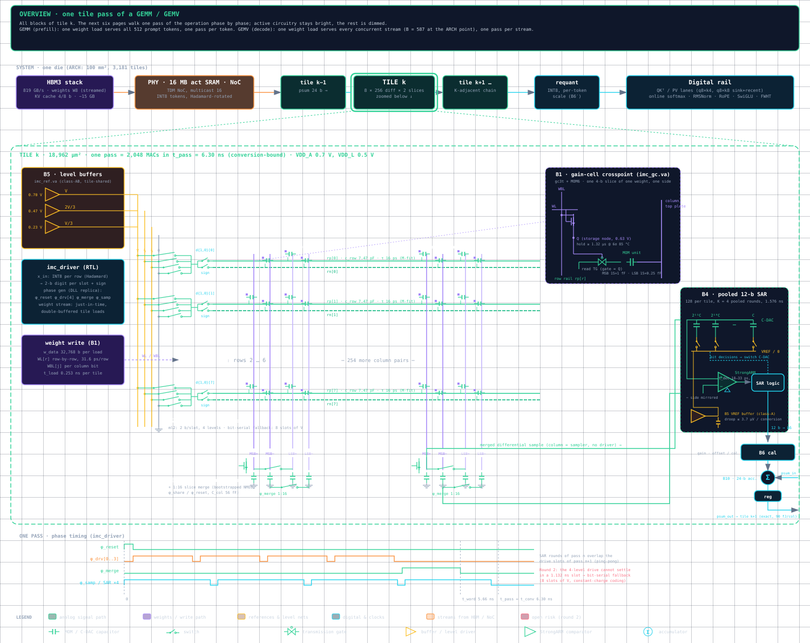

# HT-AIMC

An analog in-memory-compute (IMC) transformer accelerator targeting **ASAP7** (7 nm FinFET,
predictive). Weights stream from HBM into charge-domain tiles. Each 8-row × 256-column tile
multiplies and accumulates in charge, converts once per column with a pooled SAR, and passes its
partial sums down a 24-bit accumulator chain to the next tile.

**Status.**
- **Architecture search: done.** Two rounds, scored with [`ARCH_METRIC.md`](docs/src/content/Project/ARCH_METRIC.md)
  (tok/s per die first, then TOPS/W, tok/W and tok/J). The pick is
  [`ARCH_CHOSEN.md`](docs/src/content/Project/ARCH_CHOSEN.md).
- **Verilog-A verification: in progress.** It uses a digital driver that runs the tiles like a
  systolic array (`analog/imc_tile`, `digital/imc_driver`).
- **ASAP7 transistor-level generator: next.**

The earlier sky130 chip was removed on 2026-10-06 and remains in git history.

## Architecture



The tile, block by block. The same diagram split into the phases of one pass is
[`imc_tile_phases.pdf`](docs/architecture/imc_tile_phases.pdf). The phases are weight load,
reset, drive slots, slice merge, conversion, and accumulate and hand-off.
[`imc_tile_phases.html`](docs/architecture/imc_tile_phases.html) is the browser version, with an
export toolbar.

| Block | Function | Model |
|---|---|---|
| B1 | Gain-cell weight store: W8 as two 4-bit slices on MOM unit caps, differential | `analog/imc_tile/va/imc_gc.va`, `imc_xp.va` |
| B2 | Row drive: 2 activation bits per slot as one of 4 rail levels (round 2: bit-serial fallback) | `analog/imc_tile/va/imc_rowdrv.va` |
| B3 | Column charge share and the 1:16 slice merge | `analog/imc_tile/va/imc_col.va` |
| B4 | Pooled 12-bit SAR; the column is the sampler | `analog/imc_tile/va/imc_sar.va` |
| B5 | Reference and level buffers | `analog/imc_tile/va/imc_ref.va` |
| B6, B10 | Per-column calibration, 24-bit accumulator chain, requant to INT8 | `digital/imc_driver/src/imc_chain.v` |
| Driver | Weight streaming (just in time, double-buffered), phase sequencing, systolic job schedule | `digital/imc_driver/src/` |

The IMC chip has to beat a digital weight-stationary systolic array,
[`digital/sysreference/`](digital/sysreference), scored with the same metric under our conditions
and under Etched Sohu's published conditions.

## Components

| Path | What |
|---|---|
| [`analog/imc_tile/`](analog/imc_tile) | Verilog-A models, testbenches and the block doc of the chosen tile |
| [`analog/common/`](analog/common) | Shared Python (bench, corners, ASAP7 fin-quantized devices, PEX) and the substrate2 layout crate |
| [`analog/docs/`](analog/docs) | ASAP7 characterization, gm/ID tables, `pdk_specs`, system laws (`specs.py`) |
| [`analog/library/`](analog/library) | Submodule: components shared across projects |
| [`digital/imc_driver/`](digital/imc_driver) | Tile-array controller RTL and its iverilog regression, bit-exact against the golden |
| [`digital/sysreference/`](digital/sysreference) | Digital systolic baseline (weight-stationary INT8) and its bit-exact regression |
| [`scripts/compiler/metrics/arch_eval/`](scripts/compiler/metrics/arch_eval) | Architecture evaluator: the four metrics under both condition sets |
| [`scripts/golden/imc_tile.py`](scripts/golden/imc_tile.py) | Bit-true reference of the chosen tile, plus its analog-error model |
| [`scripts/compiler/`](scripts/compiler) | GGUF reader, number formats, and the sky130-era compiler and campaigns |

## Repository layout

| Dir | What |
|---|---|
| [`analog/`](analog) | The IMC tile block plus shared analog code and PDK data |
| [`digital/`](digital) | RTL, testbenches, synthesis and LibreLane flows |
| [`scripts/`](scripts) | Compiler, golden models, metrics; test weights in `models/` (not committed) |
| [`docs/`](docs) | Docs site (Vite + Bun). Research docs live in `src/content/Project/` |
| [`.flows/`](.flows) | Nix environment and flow tooling |

Spec: [`CONTRACT.md`](docs/src/content/Project/CONTRACT.md) ·
log: [`STATUS.md`](docs/src/content/Project/STATUS.md) ·
measured numbers: [`METRICS.md`](docs/src/content/Project/METRICS.md) ·
agent guide: [`AGENTS.md`](AGENTS.md) ·
missing tools: [`REQUIRED_TOOLING.md`](REQUIRED_TOOLING.md)

## Quick start

All tools come from Nix (ESPice, VerA, xschem, klayout, yosys, iverilog, LibreLane, ...).

```sh
./env.sh                       # enter the shell (analog | digital | mixed)
PDK=asap7 ./env.sh analog      # select ASAP7 instead of sky130

python3 scripts/golden/test_golden.py
python3 scripts/compiler/test_compile.py    # needs scripts/models/smollm2-135m-q8_0.gguf
make -C digital/imc_driver test                      # driver vs golden (iverilog)
make -C digital/sysreference test                     # systolic baseline (iverilog)
python3 scripts/compiler/metrics/arch_eval/test_arch_eval.py

cd docs && bun install && bun run dev       # docs site
```
