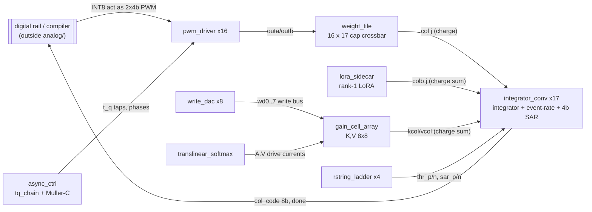
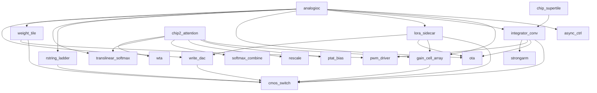

# analog/

One directory per block. Each block has `netlist/`, `va/` (Verilog-A golden model),
`test/`, `docs/architecture.md`, `schematics/`, `layout/`, `build/` and `output/`.
Follow the `analog-design-flow` skill. System specs and the full signal chain are in
[`docs/architecture.md`](docs/architecture.md).

## Chip 1: MVM path (`analogioc`)

## Block hierarchy

| Block                                            | Role                                                  |
| ------------------------------------------------ | ----------------------------------------------------- |
| `ota`                                            | Telescopic-cascode OTA, column integrator amplifier   |
| `strongarm`                                      | Clocked latch comparator (coarse loop, SAR trials)    |
| `cmos_switch`                                    | Transmission gate: steering, resets, tap muxes        |
| `pwm_driver`                                     | PWM envelope onto the two-phase SC grid               |
| `async_ctrl`                                     | Self-timed sequencer + `tq_chain` t_q tap line        |
| `ptat_bias`                                      | PTAT reference, softmax-class tail bias               |
| `rescale`                                        | Translinear ratio pair, g = exp(beta dV) <= 1         |
| `softmax_combine`                                | Level-1 group logsumexp over banks' V_ls              |
| `translinear_softmax`                            | 8-input subthreshold softmax, source node = logsumexp |
| `wta`                                            | Source-follower running max with replica VGS cancel   |
| `gain_cell_array`                                | 8x8 2T gain cells, column write, PWM row read         |
| `write_dac`                                      | 4b R-string DAC, programs gain cells                  |
| `rstring_ladder`                                 | 4b R-string, converter thresholds and SAR span        |
| `weight_tile`                                    | 16x(16+1) charge-domain crossbar, 4b diff cap banks   |
| `integrator_conv`                                | Column converter: integrator, event-rate loop, 4b SAR |
| `lora_sidecar`                                   | Rank-1 LoRA summing onto tile columns                 |
| `analogioc`, `chip2_attention`, `chip_supertile` | Top-level assemblies                                  |

Shared python lives in `common/` (bench, corners, devices, pex, substrate2 layout).
Components that other projects will reuse go in `library/` (submodule, see `AGENTS.md`).
