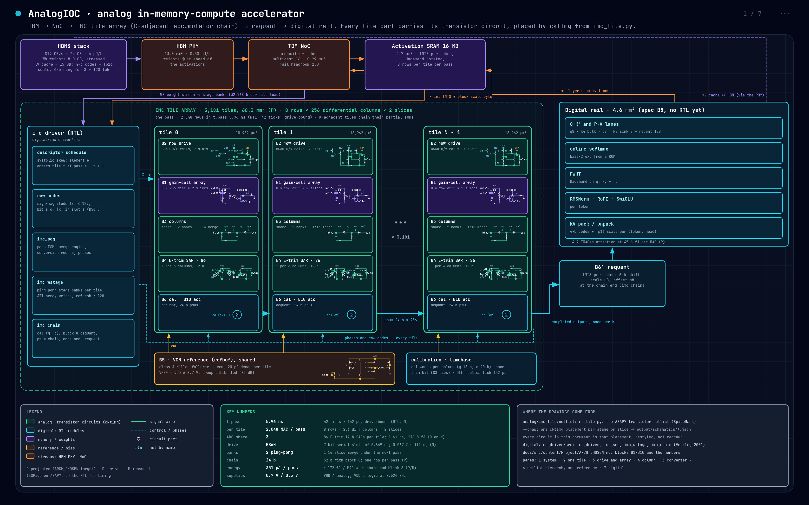

# Architecture summary

2026-10-07. A one-page summary. The spec is `ARCH_CHOSEN.md`, the decision record
`ArchResearch/DECISION.md` and the metric `ARCH_METRIC.md`. Labels: **M** measured (SPICE,
RTL simulation, quality harness), **D** derived (a law on measured parameters), **P** projected
(`arch_eval` model or literature). Scores are tok/s per die / TOPS/W / tok/W / tok/J.

### Architecture

Photo:

`docs/architecture/imc_architecture.pdf` is the full drill-down: every block drawn with its
transistor circuit inside, from `analog/imc_tile/netlist/imc_tile.py` through cktImg.
Regenerate it with `docs/architecture/gen_architecture.py`.

A streaming, charge-domain IMC die. Weights stream from HBM into analog tiles just ahead of the
activations that use them. Each tile multiplies by passive charge sharing and reads out once per
weight column. A digital rail does attention, softmax and the KV cache.

Blocks:

| # | Block | Implementation | Key numbers |
|---|---|---|---|
| B1 | Weight store | Gain cell holding W8 as two 4-b slices of charge on MOM capacitors (MSB 1 fF, LSB 0.25 fF units), differential | 8 rows × 256 columns × 2 slices per tile; write 0.70 fJ/bit; retention ≥ 1.32 µs (P). At transistor level it needs a buffered output: 5 T per bit, not 3 (M) |
| B2 | Row drive | BS6H: bit-serial \|x\| planes on 0/V rails, 6-tick (0.849 ns) slots, 7 slots per word | Settling 0.067 % at the share edge (M); needs R_PDN ≤ 0.4 Ω per tile; 108 pJ per pass (D) |
| B3 | Column | Bootstrapped share switch, C_col 56 fF, two ping-pong accumulation banks, 1:16 MSB/LSB charge merge on the idle bank | Merge hidden under the next pass; 88 pF of bank caps per tile (D, not yet priced in the score) |
| B4 | Column ADC | E-trim noise-aware 12-b SAR: 6 decisions on a fast double-tail (1.82 mV), a redundant step, then 7 on a quiet tail-starved double-tail (0.60 mV); 3 columns per converter; the MSB bank is the C-DAC | 1.61 ns and 277 fJ per conversion (D on M); 86 converters per tile |
| B5 | Reference | Class-A buffered C-DAC reference, shared per tile | ≤ 3.7 µV droop per conversion (spec; the Verilog-A bench shows 130, open) |
| B6 | Calibration and dequant | Per-column affine calibration, then the block-8 scale multiply (5-bit-mantissa scale bytes) | 0.11 dB format cost (D); bit-exact RTL (M) |
| B7 | Activation buffer and NoC | 16 MB SRAM, TDM NoC with multicast 16 | 4.7 mm² |
| B8 | Digital rail | Q·Kᵀ and P·V lanes, online softmax, RMSNorm/RoPE/SwiGLU, Hadamard (FWHT) rotation, KV pack/unpack. KV 4 b, plus a 4-b residual for 8 sink and 120 recent tokens | 14.7 TMAC/s; KV quality +0.21 % PPL (M, proxy) |
| B9 | HBM | One HBM3 stack per 100 mm² die | 819 GB/s, 24 GB, 13 mm² PHY |
| B10 | Accumulator chain | Output-stationary 24-b partial-sum chain down the K-adjacent tiles | Exact; one hop per pass |
| — | Controller | `digital/imc_driver`: systolic-style sequencer, weight stager, chain, requant | Pass 5.96 ns on the RTL (M); 25 cases bit-exact (M) |

One pass is 2,048 MACs (8 × 256, both slices) in 5.94 ns, drive-bound (D; RTL 5.96 ns, M).

Justification:

- **Stream everything (user constraint).** Weights and activations both come from HBM, and each
  weight write pays off over every activation it meets before it is replaced. That makes the
  write path (B1) and reuse the first-order costs.
- **Charge domain, passive share.** The multiply-accumulate is charge sharing: no static current
  and 3.66 fJ per MAC in the array (P). Time-domain/PWM inputs need 2ᵇ steps per pass, and
  current-mode unary packets are dominated (60.1k tok/s, below the chosen design).
- **Gain cell, no SRAM (user constraint).** Weights are analog charge. The 3T gain cell
  cut transistors per weight by 30 %. The transistor run then showed the bottom-plate kick needs a
  buffered output (M).
- **W8 as two slices, merged in charge.** W8A8 with Hadamard rotation is the lossless quality tier
  (G1). Merging the slices 1:16 in charge before converting halves the conversions (one per weight
  column, not one per slice).
- **BS6H drive.** The four-level drive cannot settle: 0.64 % against 0.1 % (M), and buffers stiff
  enough would draw about 140 W per die (D). Bit-serial 0/V rails settle. 6-tick slots, with the
  merge hidden on the idle bank, bring the word to 5.94 ns at no extra area or energy.
- **E-trim SAR.** The measured StrongARM noise (4.05 mV) fails the accuracy gate by 7.9 dB.
  Resizing it to about 1 mV costs 16× the size and about 40 % of tok/s. Splitting the search
  into fast and quiet decisions meets the gate at 1.09× the converter energy.
- **3 columns per converter.** With 4 the conversion binds the pass (7.36 ns). With 3 the drive
  binds (5.94 ns): +8.6 to +16 % tok/s and +3 % TOPS/W for 1.2k µm² per tile (P).
- **Block-8 operands.** Per-token activation scaling fails the accuracy gate by 12 dB on this tile.
  Rescaling each 8-row block fixes it at 0.11 dB.
- **Class-A reference, not a bandgap.** ASAP7 has no BJT or resistor models to sign off a bandgap.
- **Accumulator chain (T2).** It is exact, removes partial-sum traffic from the buffer and gives
  +4.9 % TOPS/W (P).
- **KV 4/8 and 16 MB.** The compressed KV cache raises the batch at the KV limit (more streams
  share each weight fetch). The buffer hides the prefill activation spill.

**Where it stands (P).** With the same weight and KV formats, the analog die ties the systolic
baseline on tok/s (1.01× ARCH, 1.00× Sohu, `cli.py`) and leads on TOPS/W (1.04×). The decision
record's corrected frame gives 1.05× (ARCH) and 1.16× (Sohu) against the synthesized PE, and
0.80× / 0.84× against the literature PE. Decode is HBM-bound on both machines
(`docs/architecture/roofline.pdf`). The tile is correct at the logic level (M) and meets the
accuracy gate at TT (+0.84 dB, D on M), but the transistor-level MAC residual (0.72 % vs 0.2 %) and
converter INL (6.8 vs 4 LSB) still fail (M).

### Tradeoffs between blocks (The pareto set)

The front runs between tok/s and TOPS/W (tok/W tracks TOPS/W). Each point below is one concrete
combination of blocks. All scores are P, ARCH conditions, the evaluator's ranking frame, before
the judges' pessimistic penalties. "Infeasible" means a measured check failed.

**The points on and near the front**

| Row drive | Readout | Cell and caps | Other | tok/s | TOPS/W | tok/W | tok/J | What it trades |
|---|---|---|---|---|---|---|---|---|
| **Bit-serial, 6-tick slots (5.94 ns word)** | **E-trim double-tail SAR, 3 columns per converter, ping-pong banks** | **Buffered gain cell; 1 / 0.25 fF units; bank caps in their own MOM area (18.4k µm² per tile)** | KV 4/8, 16 MB, class-A reference | **49,168** | **13.21** | | | The chosen design, with every known cost priced |
| same | same | bank caps placed under the array in shared metal | same | 66,565 | 11.60 | | | +35 % tok/s and −12 % TOPS/W, if layout can stack the caps |
| same | E-trim SAR, **4** columns per converter | bank caps priced | same | 43,196 | 12.78 | | | 22 fewer converters (−1.2k µm² per tile); conversion binds the pass at 7.36 ns: −12 % tok/s |
| 4-level, 2 b per slot, levels from **two extra die supply nets** | Sampled 11-b SAR | 2 fF units | KV 4/8, 16 MB, LVT logic | 68,488 | 10.47 | 611 | 625 | Fastest feasible-on-paper point, closes SS and FF. Needs the two mid-level nets at ≤ 1.3 Ω per tile (not extracted). −21 % TOPS/W against the chosen design |
| Bit-serial from VDD/GND, 7-tick slots | Sampled 11-b SAR | 2 fF units | KV 4/8, 16 MB, LVT logic | 61,495 | 9.65 | 568 | 568 | The same tile without the extra nets: corner-clean, −10 % tok/s |
| Bit-serial, bottom-plate sampled, constant-charge rows (32-fin) | Direct 12-b SAR shared by 4 pooled tiles | 1 fF units | KV 4/8, 16 MB | 64,188 | 9.78 | 559 | 571 | No extra nets and no droop calibration; 6.56 ns pass, 20.9k µm² tile, G2 margin only +0.14 dB |
| 4-level, buffered levels per tile | Pipelined residue-amp SAR, 6 columns per converter on 4 pooled tiles, 3 b per cycle | 1.25 fF units | KV 4/8, 16 MB | 60,835 | 11.22 | 629 | 643 | Fewest converters. The pooling bus wire and preamp area are the risk, and pooling is incompatible with block-8 scales |
| 4-level, buffered levels per tile | Residue-amp 12-b SAR, 4 columns per converter, bridge merge | 1.75 fF units | KV 4/8, 16 MB | 47,129 | 10.05 | | | TT only. With 2.5 fF units it closes the corners at 33.6k (−28 %) |
| 4-level, buffered levels per tile | Direct 12-b StrongARM SAR on 4 pooled tiles | 3T gain cell, 0.2 fF LSB units | KV 4/8, 16 MB | 68,890 | 10.88 | 613 | 629 | **Infeasible**: the level buffers do not settle (0.64 %, M) and the StrongARM noise fails G2 by 7.9 dB (M) |
| 4-level, buffered levels per tile | Direct 12-b StrongARM SAR on 4 pooled tiles, 86 µV comparator assumed | 1 / 0.25 fF units | KV 4/8, 16 MB, bandgap-free reference | 67,922 | 15.56 | 825 | 834 | **Infeasible**, same two reasons. The level buffers alone would draw about 140 W per die (D) |
| none (weight-MSB digital hybrid) | Sampled 11-b SAR | 2 fF units | KV 8, 2 MB, LVT logic | 47,766 | 9.63 | 512 | 549 | Built for corners: +0.52 dB at SS, +0.86 dB at FF with no adaptive VDD. Adding KV 4/8 and 16 MB gives 62,014 / 10.42 |
| 4-level | 11-b SAR | 1 fF units | KV 8, 8 MB, SLVT logic | 53,864 | 10.45 | 547 | 690 | The KV8 tok/s end. Fails SS by 1.60 dB; SLVT leakage puts the FF die over 1 W/mm² |
| 4-level | Time-domain (VTC) SAR on pooled tiles | 1 fF units | KV 8, 32 MB, LVT logic, lean INT8 rail | 52,157 | 16.38 | 767 | 945 | −3 % tok/s for 1.57× TOPS/W against the line above |
| 4-level | Time-domain (VTC) SAR | 1 fF units | KV 8, 32 MB, charge-reservoir reference, lean rail | 34,976 | 27.17 | 1,069 | 1,115 | The TOPS/W end: the reservoir reference is cheap but slow. Against the KV8 tok/s end: −35 % tok/s for 2.6× TOPS/W |
| PWM inputs (2⁸ time steps) | Time-domain SAR | pure charge domain | KV 8, 8 MB | 17,548 | 27.55 | 1,078 | 1,078 | Shows why PWM is rejected: −50 % tok/s for no TOPS/W gain over the line above |
| — | — | — | Systolic, synthesized INT8 PE, same formats | 46,398 | 10.61 | 600 | 968 | The baseline |
| — | — | — | Systolic, literature INT8 PE, same formats | 61,005 | 18.30 | 939 | 1,705 | The strongest baseline |

The last four analog rows assume a 6 dB quality credit that was later disallowed, so their tok/s is
optimistic. They are here for the shape of the front: at a fixed system ceiling, the tile choices
move TOPS/W far more than tok/s.

**What each block trades**

| Block | The axis | Numbers |
|---|---|---|
| **Row drive** | Bits per slot (speed) against settling, supply stiffness and energy | **2 b per slot**: 4.5–5.7 ns per word, but it needs two mid-level voltages. Per-tile buffers settle to 0.64 % against 0.1 % (M) and would draw about 140 W per die. Die-level nets work only if ≤ 1.3 Ω per tile. **1 b per slot, 7 ticks**: 7.95 ns; at 0.4 Ω it settles even at SS (0.043 %), at today's 1.3 Ω it does not (0.742 %, M). **6 ticks** (chosen): 5.94 ns, needs R_PDN ≤ 0.4 Ω; otherwise constant-charge dummies double the drive energy (108 → 205 pJ per pass). **Capacitor-ratio 2 b per slot**: 3.96 ns and half the drive energy (57 pJ), for +12 % tile area and zero G2 margin |
| **Comparator** | Noise against energy and time (energy ∝ 1/σ²) | StrongARM: 4.05 mV at 2.9 fJ, fails G2 by 7.9 dB; ×16 to reach about 1 mV costs 724 fJ per conversion and −40 % tok/s. **E-trim** (chosen): 1.82 mV fast + 0.65 mV quiet decisions, 277 fJ, 1.61 ns, +0.84 dB. FIA preamp: 0.47 mV but 2.5–4.9 ns per conversion, −24 % tok/s. Residue amplifier: 3.7× energy and 7.9× area per conversion |
| **Converters per tile** | Count against pass time | 64 (4 columns each): conversion binds at 7.36 ns. **86 (3 each)**: the drive binds at 5.94 ns, +12 to +16 % tok/s for +1.2k µm². 128 (2 each): conversion fully hidden but the tile grows 45 % (19.0k → 27.5k µm²) |
| **Tile pooling** | Fewer converters against flexibility | Sharing one converter across K tiles saves converters but needs a bus wire and equal scales on the pooled tiles, which block-8 operands break |
| **Merge** | Hidden merge against capacitance | Ping-pong banks remove the 1.13 ns merge slot from every pass (+19 % pass rate) for 88 pF per tile. In their own MOM area that is −26 % ARCH tok/s |
| **Unit capacitor** | kT/C margin against energy and area | 1 / 0.25 fF (chosen) passes TT and FF; SS needs the signal rail held at 0.7 V. 2 fF units close every corner with no adaptive supply. 2.5 fF closes them at −28 % tok/s |
| **Gain cell** | Transistor count against charge-share error | 3T: 112 transistors per weight (−30 %), but the share kick gives 3.3 % error (M). Buffered (chosen): +2 transistors per bit, settles to 0.067 % (M), area not priced yet |
| **Reference** | Energy against speed and sign-off | Class-A buffered (chosen): 46 pJ per pass, signable. Bandgap + LDO: cheaper, but ASAP7 has no BJT or resistor models. Charge reservoir: highest TOPS/W (27), lowest tok/s |
| **Logic threshold** | Speed against leakage | SLVT is fastest, but its leakage pushes the FF die past 1 W/mm². LVT and RVT stay inside the cap |
| **Weights in HBM** | Bytes against quality | W8 (chosen) is the lossless tier. W4 halves weight bytes and leaves more KV room, but it is only the acceptable tier |
| **KV cache** | Batch against quality | KV 16 → 8 → 4/8 raises the KV-limited batch 184 → 368 → 587 streams (W8). 4/8 costs +0.21 % PPL (M, proxy) |
| **Activation buffer** | Spill against area | 2 MB spills prefill activations to HBM. 16 MB (chosen, 4.7 mm²) removes the spill, out of the 17 mm² of unused die |

### Application where it can beat turn Decode from memory bound into Compute Bound

Decode is compute-bound when its arithmetic intensity passes the die's ridge point:
**1,230 ops per HBM byte** under ARCH (1,007 TOPS over 819 GB/s), 2,626 under Sohu. Plain decode
reaches 527 at the KV-limited batch of 736 and can never pass about 810 at any batch, because
every stream reads its own KV cache (D, `roofline.py`). An application turns decode compute-bound
by sharing each HBM byte across more tokens:

| Application | Mechanism | Crosses the ridge when (ARCH, D) |
|---|---|---|
| Speculative decoding, multi-token prediction | The big model verifies k drafted tokens per step: each weight and KV read serves k tokens | k ≥ 3: 1,580 ops/B at B = 736. The step becomes 33.6 ms of compute (26.1 ms of memory) for 3 tokens: 2.3× decode throughput |
| Parallel sampling, beam/tree search, agents sharing one system prompt | n streams share one prompt's KV, so it is read once per group, and more streams fit | n ≥ 4: 1,475 ops/B (B = 1,835) |
| Short-context, high-batch generation (classification-style outputs, short chat turns) | Less KV per stream, so weights dominate the bytes and the batch can grow | 256 tokens: B ≥ 1,578; 128 tokens: B ≥ 885; 64 tokens: B ≥ 726 |
| Small-KV models (MQA, MLA-class) | 8–16× fewer KV bytes per token | B ≥ 744 (MQA), B ≥ 666 (MLA-class) |
| Does not work: long context, batch 1, MoE | KV dominates (2,048 tokens: 172 ops/B); no reuse (2 ops/B); fewer tokens per expert's weights | — |

Under Sohu conditions (ridge 2,626, decode 348 at B = 1,000), speculative decoding needs k ≥ 8.

**Where the analog die then beats the systolic die.** Once decode is compute-bound, throughput is
the lower of the compute roof and the power roof (1 W/mm² × TOPS/W), and both machines sit near
their power roofs. The analog advantage becomes its TOPS/W ratio:
- 1.04× with the four-level-drive tile as scored by `cli.py`, against the synthesized systolic PE (P);
- about 1.2× for the upgraded tile with its bank caps priced (13.21 against 10.61, P, from two different scoring frames);
- a loss (about 0.7×) against the literature systolic PE at 18.3 TOPS/W.

So these applications are where the analog tile can matter, and the energy per MAC (bottleneck 2
in `ARCH_CHOSEN.md` §10) decides whether it wins. The mechanisms themselves are digital and
compiler work (draft model, KV sharing, scheduler), outside the tile.
