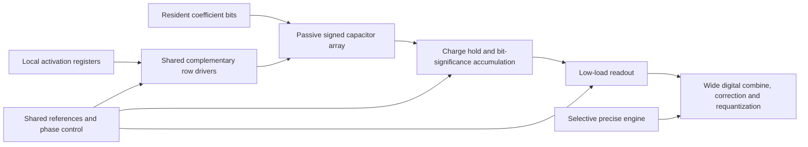

# Circuit and architecture convergence

Research continuation, updated 2026-09-09. **The leading candidate is a passive charge-domain array with shared complementary row drivers, retained charge for bit significance, and a direct low-load readout.** Use two four-bit weight planes as the INT8 quality reference. Use a cheaper INT4 mode only after quantization/adaptation passes the same quality target.

The research targets are **100 TOPS/W minimum and 250 TOPS/W stretch**, counted as native useful arithmetic at matched model quality and a complete power boundary. These require **20 and 8 fJ/MAC**, respectively. Mythic M1 is a historical comparison point, not the stopping criterion. These are targets; the experiments do not yet demonstrate a complete chip at either efficiency.

The current ballast-heavy, repeatedly switched, OTA-integrated tile remains the functional reference. This round develops and sizes experimental replacements; it does not replace the accepted compiler, digital rail or operational circuit generators.

The matched converter comparison is now concrete:

| Same twelve-input test | Starting reference | Sized VCM/holder candidate | Change |
|---|---:|---:|---:|
| TT27 positive delivery | 2.53058 pJ/conversion | 1.45114 pJ/conversion | 42.7% lower |
| SS85 positive delivery | 2.56082 pJ/conversion | 1.51471 pJ/conversion | 40.8% lower |
| Complete cycle | 345 ns | 295 ns | 16.9% higher service rate |

That candidate also passes the reused eight-column TT/SS development cases
and rejects the deliberately incorrect bridge, but fails the next TT
seed-9952 case by two codes near input18.04. These are verified development
improvements, not a generally qualified converter or full-chip tokens/J.
Current work removes the optional negative holder, uses interior calibration
with two fractional positions per anchor, and keeps seed9953 reserved until
the preceding gates pass. The bounded startup comparison additionally falls
568.1→94.5s; its physical warmup pulse has separately recorded energy.
[Converter results](IMC_NULL_SAR.md), [independent audit](IMC_NULL_SAR_REVIEW.md).

## 1. What the new evidence changes

| Design question | Result | Decision |
|---|---|---|
| Can more ADC sharing rescue the old tile? | 810 macro / 12,960 workload scenarios; no current-topology point fits the provisional eight-die resident package and service constraints | Change the array topology and storage/periphery organization |
| Should every weight capacitor be enlarged? | Fixed mismatch falls with Cu, but old per-bank ballast already violates the proposed density budget | Use physically larger, shared compute capacitors with denser resident coefficient storage |
| Can calibration replace all that capacitance? | Exact characterization improves mismatch; noisy redundant coding can increase both error and switching | Limit calibration and include characterization uncertainty and configuration cost |
| Is the earlier digital hotspot universal? | Layer-11 protection improves fixed-mismatch KL only about 4%, versus 5–8× for the earlier output-noise experiment | Allocate precision separately for weight, input and converter errors |
| Is naive W4 a fair quality reference? | Its reference perplexity is about twice the original model on these passages; two-slice W8 largely preserves it | Keep a costed W8 path while improving W4 quantization |
| Does low signal swing always save useful energy? | The old charge-equivalent low-swing candidate settles, but its modeled ADC-input SNR becomes poor | Size signal swing, total capacitance and converter together |
| Can a physical accumulator eliminate bit-plane conversions? | Actual signed 128×8 replay reaches 69.66 dB deterministic accuracy after matched reset sizing | Retain bit significance in charge, then convert once per weight slice; close noise and PVT next |
| Can smaller switches always save energy? | Matched 0.84-µm resets save 2.47× interface energy at 16 rows, but the 128-row array needs 3.36 µm to pass | Size reset and sharing paths against the actual array capacitance |

Detailed evidence: [physical sizing](IMC_SIZING_RESEARCH.md), [capacitor calibration and full-model tests](IMC_CAPACITOR_SIZING.md), [architecture search](IMC_ARCHITECTURE_SEARCH.md), and [primary circuit/competitor targets](IMC_CIRCUIT_TARGETS.md).

## 2. Concrete circuit organization

The proposed macro stores coefficient bits locally. Two shared row buses carry opposite activation polarities. A programmed sign selects the appropriate bus for each column's physical capacitance. Column reset establishes a known initial charge; evaluation produces a passive normalized signed sum. There is no continuously biased virtual-ground OTA in this candidate's multiply path and no 4-fF top ballast at every weight bank.

This diagram is an architecture proposal. The significance accumulator has nominal transistor-simulation evidence. SRAM configuration, a complete physical ADC, noise/yield, reference generation, routing and digital integration still require explicit implementation evidence. The experiments label their own included boundary; an ideal reference source or numerical conversion is not treated as a completed circuit.

Carry **4–8 fF effective units**, a **120-fF initial output load**, and **±0.45-V reference excursion around a 0.9-V common mode** into the next loaded comparison. These are tested electrical values, not a finished capacitor layout. The 4-fF option requires an extracted MOM or another suitable geometry; nominal Sky130 minimum MIM area alone corresponds to approximately 8 fF before peripheral capacitance.

The tractable prototypes now include **actual signed 16×8 and 128×8 arrays**, not only repeated identical-column loads. The latter amortizes a readout over eight times more products. Increasing column count remains a loading experiment: the earlier loaded-array tests demonstrated that unchanged row drivers can fail. Evaluate 64-row subdivisions when the larger normalized output demands excessive ADC precision.

The physical accumulator uses equal effective array and hold capacitance, LSB first: `h_next=(h_previous+partial)/2`. After B planes, the ideal held voltage is `g*Wx/2^B`. Its sharing switch disconnects before array return/reset, and the hold capacitor resets once per word. A per-column gain cannot repair arbitrary unequal radix ratios; deliberately adding 1% hold capacitance failed the whole-word error screen.

| Actual circuit replay | Positive delivered interface energy | Complete interface time | Whole-word deterministic result |
|---|---:|---:|---|
| 16×8, fixed five planes, 6.72-µm matched resets | 14.70 fJ/MAC | 265 ns | 69.83 dB, nominal PASS |
| Same inputs/schedule, 0.84-µm matched resets | 5.95 fJ/MAC | 265 ns | 67.00 dB, nominal PASS |
| 16×8, dynamically omit empty leading planes | 5.745 fJ/MAC | 247.3 ns average | 67.45 dB nominal; tested slow corner fails |
| 128×8, eight planes, 0.84-µm resets | 4.397 fJ/MAC | 424 ns | 34.31 dB, FAIL; reject this energy point |
| Same 128×8, 3.36-µm matched resets | 5.140 fJ/MAC | 424 ns | 69.66 dB, nominal PASS |
| 128×8, 3.36-µm resets, dynamic seven/six/five planes | 4.500 fJ/MAC | 318 ns average | 67.57 dB nominal; slow corner fails at 0.931-MAC RMS |
| Same 128×8, sharing hold extended 7.6→15.6 ns | 4.587 fJ/MAC at slow/hot corner | 366 ns average | Slow/hot PASS: 62.47 dB, 0.103-MAC RMS, 0.223 maximum |
| Same extended sharing interval, nominal corner | 4.500 fJ/MAC | 366 ns average | Nominal PASS: 70.13 dB, 0.0428-MAC RMS, 0.0793 maximum |

All rows are **W4A8 interface measurements from noiseless schematic simulation**, with fixed coefficient capacitors and real Sky130 switches. The three held-out vectors and eight columns are a small compiler-derived fixture. Complete ADC conversions executed in these probes: **zero**. The final readout is still a modeled service. Positive energy includes all ideal voltage-source ports before summing; it excludes physical clock/reference generation, weight memory and control, ADC, extracted diffusion/wiring, and system work. The models have no explicit diffusion areas/perimeters. These numbers cannot be compared directly to a chip's TOPS/W.

At 16 rows the fair separate-read baseline uses the same reset sizing and five useful planes: 3.740 fJ/MAC and 220 ns. Physical accumulation adds **2.206 fJ/MAC and 45 ns**, in exchange for four fewer future ADC services per output. It also changes the readout noise requirement. An unchanged converter is not an equal-accuracy comparison.

The slow-corner repair follows a [saved-waveform diagnosis](../../../../scripts/compiler/metrics/imc_radix_settling_diagnosis.py): the sharing interval was fixed even when row evaluation was lengthened. The accumulator was still moving at its switch-off edge. Extending only that interval, with following edges shifted together, closes the original whole-word error gate with negligible change in energy. Row devices remain 0.42 µm, array/hold reset devices 3.36 µm, and sharing devices 6.72 µm, all at 0.15-µm length. It changes neither device count nor coefficient values. This is a deterministic PVT result, still subject to the omitted noise and extracted parasitics.

Do not solve capacity by duplicating this capacitor bank for every large-model weight. Under the illustrative eight-die budget, a 4-fF compute capacitor needs at least approximately 29-way reuse across SRAM bits for an 8B W4 model, or 58-way for W8, even before other capacitors and SRAM area. **32/64 stored bits per reused compute element are exploration requirements**, not implemented density claims. If those coefficient groups are all used every token, their service times add. Resident storage removes external reloads only when the local bank schedule and ports can feed the compute circuitry.

## 3. The quality and energy targets

**20 fJ/useful MAC all-in is the minimum research objective; 8 fJ is the stretch objective.** The former is 12–16× the efficiency of the current M1 headline, and the latter 30–40×, solely as arithmetic targets. M1's 25 TOPS at 3–4 W corresponds to 240–320 fJ/MAC; its advertised precision and power boundary must also match before claiming that multiplier. [Mythic M1](https://www.mythic.ai/m-1).

Subtracting the nominal 128-row **W4** interface measurements gives concrete remaining budgets:

| Target | Total fJ/useful MAC | Remaining per output, fixed eight planes | Remaining per output, measured dynamic planes |
|---|---:|---:|---:|
| 100 TOPS/W | 20 | 1.902 pJ | 1.984 pJ |
| 250 TOPS/W | 8 | 366 fJ | 448 fJ |

These are strict residual budgets for **ADC and all missing work**, not ADC allocations in addition to uncounted overhead. Checksum, padding, memory, references, control and digital combination consume them too. A 16-row version leaves much less readout energy because it amortizes each output over fewer products.

**The W8 quality reference cannot inherit W4 energy.** Repeating the measured interface twice would cost 10.28 fJ/W8 MAC with eight planes, or 9.00 fJ with the tested dynamic schedule, and require two ADC services. Under that illustrative accounting, the 100-TOPS/W target leaves only 622 or 704 fJ per conversion before checksum; the 250-TOPS/W target is already exceeded before conversion. Even doubling is not a safe physical bound: a W8 low magnitude slice can have far heavier capacitor codes than the measured W4 fixture. Sharing row drive between concurrent weight slices requires a new loaded circuit measurement. This makes better W4 quantization/adaptation and binary-cell capacitor reuse central design work.

Readout research supports direct charge-null conversion on the held capacitance, a floating-inverter preamplifier with a small latch, and a time converter that activates its precision detector only near the crossing. **Mythic-style nulling is an explicit candidate**, including shared precision references and local correction. The [focused review](IMC_MYTHIC_NULLING.md) explains why the old OTA-based `NULLSEEK` rejection does not apply to all charge-null topologies. The first complete comparator-directed implementation uses a split CDAC in a separate voltage-acquisition fixture. It has not yet replaced the IMC hold capacitor: that integration requires preserving the accumulation recurrence and pricing acquisition loading. Local current-mirror charge accumulation is a separate shared-reference option.

Their published implementations have different accuracy and energy boundaries; none has yet been ported and verified at the above budgets. The [readout analysis](IMC_CIRCUIT_TARGETS.md) prices those differences. A measured approximately 1-pJ **comparison** cannot be called a 1-pJ complete multi-bit ADC. The passive core has already removed the standing compute OTA, so a derived null-versus-TIA bias multiplier cannot be applied again to its energy.

The [complete null-SAR experiment](IMC_NULL_SAR.md) executes ten physical comparator-directed decisions. The passing one-column reference costs 2.531/2.561 pJ at TT27/SS85 and 345 ns per complete cycle. A first reference-switch sizing pass reached 2.160/2.196 pJ and 295 ns on twelve development inputs, but failed an eight-column SS history by up to 6 LSB. Sizing against the floating-top switched load repaired both exposed column histories and passed the full twelve-input/eight-column TT/SS development suite. Its subsequent seed-9952 SS test still failed by 2 LSB (809.3 input → 807 output), with correct physical trial and receiver histories. That point remains a development result, not a converged replacement. The fixed −1.9-mV trim is unchanged; faster schedules, smaller acquisition devices and an unsuccessful internal-drain reset are preserved as rejected experiments.

The next physical topology uses the user's three-level SAR notes: begin with all DAC bottoms at VCM, compare, then make nine half-span updates from actual latched decisions. Its added CMOS selectors and per-column reference isolation are in the netlist and energy accounting. With unchanged trim and 295-ns cycle, the frozen candidate passes the twelve-input TT/SS development checks at **1.455/1.483 pJ per conversion**, about **42% below the original reference** on the same inputs. It also repairs the exposed SS seed-9952 column-7 history to within one code. The first full eight-column run hit the existing 600-s timeout. A physical comparator pulse during the first warmup acquisition removes a startup convergence problem: the bounded eight-column control drops from 568 to 95 seconds, preserving every measured decision and changing steady-cycle energy by 0.037%. Its extra warmup energy is recorded separately. With this pulse, the complete TT eight-column development case passes at 1.351 pJ/service, but SS fails by up to **5 LSB** at 1.377 pJ/service. The latter energy is a failed-accuracy point. Seed 9953 remains untouched; this topology has not converged. The comparator costs about 0.495/0.514 pJ; the main saving comes from mux/reference activity, not an assumed elimination of comparisons. VCM is now a precision DAC rail: its errors cause code-dependent thresholds, and a real midpoint generator and finite shared-source impedance must be priced.

The passing twelve-input energy is below the illustrative W4 dynamic residual budget of 1.984 pJ/output, leaving about 0.50 pJ for all other missing work at the slow corner. It still exceeds the optimistic **0.704-pJ W8 allowance per conversion by about 2.1×**. The converter and array have different loads/stimuli, so these are budget comparisons, not integrated measurements. Physical IMC-to-ADC acquisition, noise, mismatch, reference generation, FSM energy and extraction remain unverified. [Coarse/fine charge injection and other readout options](IMC_NULL_READOUT_OPTIONS.md) retain distinct follow-ups; both decision-stage and reference energy need further reduction.

Mythic's separate 120-TOPS/W figure is a 2027 roadmap claim, not a verified matched measurement in the reviewed sources. The 250 target goes beyond it, while retaining complete accounting. [Vanguard roadmap](https://www.mythic.ai/vanguard), [manufacturing disclosure](https://www.mythic.ai/supply-chainmanufacturing).

Full-model fixed-capacitor tests now cover W4 and two-slice W8 separately. At assumed `Ac=1% µm`, the 4-fF W8 case adds at most **0.114% observed perplexity** relative to its own W8 reference over the four tested passage/device combinations. Its W8 requantization already has nonzero error versus the original checkpoint. This is promising mismatch tolerance, but it excludes ADC/input errors and does not establish deployment quality. The [full report](IMC_CAPACITOR_SIZING.md) records all 48 cases, unfavorable results and the exact error model.

The subsequent [full-model radix experiment](IMC_RADIX_FULL_MODEL.md) explicitly converts every physical partial/slice. Dynamic block A8 improves input quantization but uses seven planes and incurs block-scale handling. With unsmoothed weights, 100-µV read noise plus the stated sharing-noise hypothesis misses the joint KL/perplexity target. [Frozen channel scaling](IMC_SMOOTH_RADIX.md) improves this substantially, but the longer tests still reject a blanket quality claim: 2/4 cases pass both gates at 100 µV, 3/4 at 50 µV, and 0/4 after shrinking Cu to 1.2 fF at 100 µV. These are distinct readout studies, not noise added to the earlier fixed-mismatch study. Combining all physical errors remains necessary.

A further calibration-only search chooses alpha from 0.25/0.5/0.75 independently for all 210 model projections, using separate calibration inputs and two calibration noise draws. It reduces mean normalized calibration MSE **17.1%** and passes all four noisy cases on the reused validation passages. Frozen choices then pass **3/4** noisy cases on two new 512-token notes; one ideal-A8 control also fails the unchanged 1% perplexity gate. That is useful adaptation evidence and an explicit remaining quantization limitation, not convergence or permission to choose a favorable noise sample. The selected vectors, unsuccessful controls and fresh holdout are preserved.

A subsequent replay retains those exact W8 weights/channel scales and adds one activation bit. Both ideal A9 controls pass on the now-exposed passages, but the ten-bit ADC-only control passes only one of two, and noisy cases pass 2/4 at 100 µV or 3/4 at 50 µV. No threshold is relaxed. Final ADC count is unchanged, while plane operations rise exactly seven to eight per service, **14.29%**. This identifies separate input and converter quantization limits and prices the extra input work; it does not establish A9 as a cheaper accepted replacement.

A fixed R256/A9/ADC11/read50 architecture screen then passes both ideal and both ADC-only controls. Its noisy cases still pass only 3/4; the failing passage/seed has a 1.01745 perplexity ratio. Actual final conversion count falls **42.31%**, including partial blocks, while median low/high slice capacitance grows to **6.980/0.828 pF**. This is a useful service-versus-precision trade, not an accepted quality point or a measured energy saving. The physical array and eleven-bit readout would both need new loaded verification.

The [subsequent grouped-weight study](IMC_GROUPED_WEIGHTS.md) tests one fixed group-128 second-order quantization recipe against matched rounding. Its W4 calibration reconstruction error improves 89.5%, but every full-depth weight-only control still fails the quality gate. Symmetric W5 and W6 also fail their controls. W7 passes two of four weight-only controls but none of four ideal-A8 controls. Single-bank W6/W7 require five/six physical magnitude bits and much larger capacitance: median 4.312/8.640 pF for their GPTQ codes. These formats reduce conversion count in principle, but none supplies an accepted lower-energy replacement for W8 on this checkpoint. The failed baseline controls prevent attributing their quality loss to the ADC.

## 4. Conditions before a chip-level claim

The circuit must first complete the **same signed reduction** at the selected W/A precision, including all reset, sample, sharing, conversion and reconstruction phases. Compare total interface energy at equal error, then add actual drivers/reference generation, resident coefficient controls and digital rail costs. Charge returned to an ideal source is not assumed to be recovered by a real regulator; report signed net energy and positive delivered energy separately.

Next replay fixed physical coefficient errors and temporal readout errors through the full model with a consistent tokenizer, context and workload. Include calibration uncertainty, corner variation, mismatched capacitor ratios, zero/canceling sums, reference disturbance and hold errors. A deterministic transient PASS is not a noise/yield result.

The [noise-tool investigation](IMC_TRANSIENT_NOISE_PATH.md) now has working isolated, exact-pin OpenVAF and VACASK builds. The upstream RC transient-noise test passes, including an independent analytic PSD/variance check. Native ngspice comparisons show matching drain current, stored charge and Cgg at the sampled input/latch geometries, but **four body/source capacitance fields differ** between BSIM4.5 and 4.8.2. A five-geometry body-sweep audit confirms equal charge curves while the 4.8 body derivatives fit finite differences much better; the source audit finds a changed derivative expression in 4.5. This is a model-Jacobian discrepancy, not a blanket capacitance-equivalence result. Stationary noise does differ between native revisions. The initial VACASK BSIM4.8 port also failed: four missing derivative terms were repaired in an isolated model, preserving the original failure. After matching native noise-job topology, all fourteen DC/charge fields across 438 biases/device agree within 1e-14 of each field peak; stationary spectra match native 4.8 within the fixed gate at TT/SS, including added body/reverse-bias probes. These qualify the inspected 4.8 implementation, not a migration of Sky130’s 4.5 noise model. A separately identified 4.8 model with the legacy 4.5 thermal-noise equations passes the 21-bias stationary spectrum comparison within 1.31 ppm at TT/SS. It remains a hybrid research model. All five latch geometries now pass the same static port gate. Following a solver-convergence study, the actual nine-transistor comparator passes both deterministic polarities at TT/SS: maximum waveform difference0.327mV and energy difference0.0033%. Intrinsic-noise activation initially fails the numerical error estimator even in a simple stiff RC control; a documented SDE noise-error setting now yields a first exploratory noisy comparator trace. Repeat/seed/zero controls and statistical/noise-bandwidth convergence are still required before an input-noise claim. No measured StrongARM noise or substitute ADC-noise result is claimed.

A checked passive model of the current two 8-kΩ/60-fF input filters gives **364.9 µV RMS differential instantaneous resistor noise** at 27 °C, excluding MOS loading/noise and reset effects. An ideal boxcar would require about 11.85 ns to reduce this component to 100 µV at the comparator nodes; that boxcar is not the comparator's measured sensing aperture. Referring through the reduced circuit's settled signal gain gives **393.4 µV** and a hypothetical **13.86 ns** boxcar. Increasing filter capacitance attenuates the stored signal too: this stationary instantaneous model minimizes residue-referred noise at 177.3 µV for a 768-fF holder. That restricted minimum is not a bound on an ADC with finite sensing time. Independent stochastic RC and split-network charge-equation checks pass. These results identify a filter/aperture design issue without claiming full clocked ADC noise.

A matched **768-fF floating negative holder** reduces unequal deterministic kickback, but its three-point-calibrated version still fails the exposed SS history by 5 LSB. Deferring the DAC update until after comparator reset did not fix that error. Saved waveforms instead expose the largest bottom plate still 8.45 mV below its target at the comparison aperture. Doubling only the RC-derived reference-switch widths, with acquisition and timing retained, cuts this to 0.425 mV and repairs the exact three-input SS history; positive delivery rises 3.54% to 1.432 pJ/service. The fixed repaired candidate passes the full reused development suite, including TT/SS eight-column cases at 1.417/1.451 pJ, but its next TT seed-9952 history fails by two codes near input18.04. That error has only about3.1µV of weighted bottom-plate settling error; it requires a separate calibration/loading diagnosis. No-holder and paired-interior-calibration controls are in progress, with reserved seed9953 untouched. The added holder also stores reset noise: a [checked passive submodel](../../../../analog/testbenches/tb_imc_holder_noise.py) gives **76.27/83.32 µV** input-referred persistent noise from that negative branch alone at TT/SS, assuming fully equilibrated thermal reset and the ideal settled signal gain. An identical independent two-holder model gives 107.86/117.83 µV before MOS/reference noise. Those are explicit submodel results, not the full split-CDAC noise; waiting or uniform averaging cannot remove their conserved charge mode. Capacitance, correlated sampling and the actual clocked sensitivity require joint sizing.

A further [redundant coarse/fine architecture](IMC_NULL_READOUT_OPTIONS.md) now has an exhaustive arithmetic proof: six coarse decisions with overlapping range and five precise decisions can reconstruct the ten-bit result under the stated bounded coarse error and ideal fine decisions. All262,144 grid inputs,520,192 adversarial coarse paths and64 continuous path intervals pass. Physical ties require strict margin below the nominal eight-LSB allowance, and fine noise still causes output error. The signed charge sequence, extra handoff and all eleven decisions must be implemented and paid; this is a route to fewer *precision* decisions, not a measured converter saving.

Finally close extracted density, all resident-bank service demands, interconnect and KV capacity/refresh. The necessary rate condition remains

`R <= min(compute service, concurrency/token latency, power/token energy, BW_j/bytes_j, maintenance service)`.

The study uses a finite eight-die/400-W scenario to make these checks concrete; it is not a user-approved production process/package requirement. A model of more dies or denser storage must include their full power and communication. Compute-bound behavior must follow from adequate capacity and bandwidth at the target rate, rather than from deliberately slowing compute to clear the memory test.

The remaining deliverable is a validated full macro and then a matched token benchmark. This round supplies experimentally narrowed circuit choices, reproducible sizing and explicit budgets for that work. Its component and statistical results should not be relabeled measured tokens/s or tokens/J.
