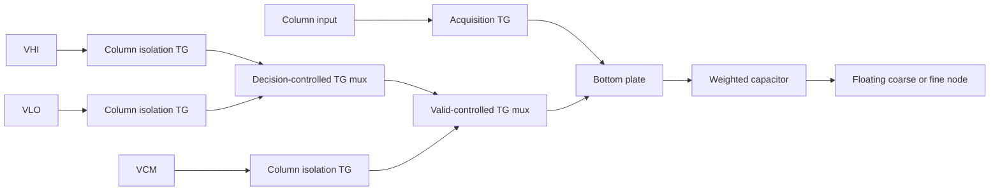

# OTA-free charge-nulling SAR: physical feasibility and sizing

This research converter performs ten actual comparator-driven binary-search
decisions on a split capacitor DAC. It is the charge-domain analogue of the
null-seeking mechanism in note **27h10**, rather than the earlier test that
strobed a comparator repeatedly against one unchanged threshold. It is a
voltage-sampling fixture, not yet the readout of the passive IMC array.

The first complete implementation exposed two costs that an ideal SAR model
misses: incomplete holder reset caused tens of codes of history error, and
reset-switch charge injection required a small threshold trim. A stronger
reset plus a fixed −1.9 mV comparator-reference trim passed the initial
12-input validation sweep at TT27 and SS85, with maximum error one code at both corners.
That passing point consumed approximately **2.53/2.56 pJ per conversion**,
including all measured positive source delivery and a paid reset every cycle.
These are noiseless schematic results, not ENOB or silicon measurements.

The subsequent RC-based switch sizing and shorter decision schedule pass the
full development suite at **2.177/2.171 pJ** for the twelve-input TT27/SS85
tests, and **2.025/2.060 pJ per service** for eight independently deciding
columns. The paid cycle is **295 ns**, versus 345 ns for the reference point.
On the same twelve inputs, this reduces positive delivery by 14.0%/15.2% and
increases the modeled converter service rate by 16.9%. These are converter
improvements, not measured token-rate or full-chip efficiency gains.
The subsequently frozen fresh-input check passes TT27 but **fails SS85 by two
codes** at one input. The RC point is therefore a development result, not an
accepted general ten-bit converter or the final optimization target.
An opt-in three-level VCM-start circuit subsequently passes the original three
calibration voltages at TT27/SS85 at **1.432/1.460 pJ per conversion**, with
the same trim and 295 ns cycle. It also passes the twelve-input development
regressions at **1.455/1.483 pJ**, reducing positive delivery by 42.5%/42.1%
against the original converter on identical inputs. Its full eight-column
seed-9951 check passes TT27 but **fails SS85 by five codes**. It is therefore
another development result, not a qualified replacement. A physical warmup
comparator pulse removes excessive startup iteration while preserving the
bounded TT8 control's measured decisions and energy; it does not repair the
SS accuracy failure.

A later fixed candidate adds a scalar negative reference holder and repairs
the two series reference-switch stages. It passes the complete reused
development suite at **1.451/1.515 pJ** for TT27/SS85 twelve-input tests and
**1.417/1.451 pJ per service** for eight columns, retaining the 295 ns cycle.
The reference-width control directly reduces the failing MSB bottom's error
from 8.45 mV to 0.425 mV; the wrong-bridge control still fails as intended.
The next seed-9952 regression **fails TT27 by two codes** at an input near
18.04 despite small DAC settling error, so this candidate also remains
unqualified. SS9952 and reserved seed9953 did not run. The negative holder's
necessity is unproven and its additional reset noise is outside these
deterministic results.

The next ablation removes that negative holder while retaining the repaired
reference switches. A predeclared paired interior calibration selects the
original −1.9 mV trim before development regression. It passes the complete
reused suite at **1.515/1.558 pJ** on the twelve TT27/SS85 inputs and
**1.420/1.456 pJ** for eight columns, maximum error one LSB. The two previously
failing histories also pass without the negative holder. Seed-9952 regression
passes both corners at **1.417/1.454 pJ** with maximum error one LSB. The
previously untouched seed-9953 confirmation passes TT but **fails SS by two
codes** at input 1017.98088, which returns 1019. The fixed candidate therefore
remains unqualified despite passing the larger development regression.

## Circuit and arithmetic

The fixture in tb_imc_null_sar.py uses
real Sky130 transmission gates, the existing StrongARM comparator, and real
minimum CMOS output receivers and DAC mux logic. Ideal capacitors, voltage
references, stimulus and timing are explicit. XSPICE flip-flops retain the
physical receiver decision; Python does not choose the bit sequence.

The input range is 0.65–1.15 V about 0.9 V common mode, with 1.8 V device supply.
The ten-bit code interval is 488.28125 µV. The coarse bank contains 63 unit
capacitors; the fine bank contains 15 weighted units plus a sampled dummy.
With `Cu = 12 fF`, their values are 756 and 192 fF. A 12.8 fF bridge gives

```
Cf = 16 Cu
Cb = Cf / 15
Cseen = 63 Cu + Cb Cf / (Cb + Cf) = 64 Cu = 768 fF
```

The holder and fine node both reset to common mode while every bottom plate
samples the input. The top resets open first, input sampling opens next, and
bottom plates then connect to the low reference. During conversion the coarse
and fine nodes float. The input acquisition load is **79 Cu = 948 fF**, not
768 fF: both top nodes were clamped while sampling. The 60 fF comparator input
filter and MOS parasitics add physical loading beyond these ideal CDAC values.

For voltage displacements `a,b` from the reset state, charge conservation is

```
[63Cu + Cb     −Cb       ] [a] = [63Cu(Vlo − Vin) + Cu floor(code/16) span]
[−Cb          16Cu + Cb ] [b]   [16Cu(Vlo − Vin) + Cu (code mod 16) span ]
```

At the ideal bridge ratio, the first component reduces to
`a = Vlo − Vin + code × span/1024`. Starting from zero code, each bit is tried
high and retained only when the real comparator reports a nonpositive residue.
The final result is the floor code, saturated to 0–1023. An exhaustive ideal
self-check verifies all 1024 codes and the two-node equations.

The numerical gate compares physical codes with this ideal floor quantizer.
Its reported code-error RMS is not temporal read noise. Interfacing the result
to a model using a round-to-nearest quantizer requires an explicit code-bin
center/offset convention, rather than silently changing the decode.

A fixed parasitic at the coarse node attenuates sampled signal and DAC steps
equally; it does not by itself produce a code-gain error at the null. A parasitic
on the fine node changes the bridge ratio. Matching, extracted parasitics and
voltage dependence therefore still matter even though there is no OTA.

## What the first physical tests changed

| Experiment | Maximum code error | Positive delivery per conversion | Interpretation |
| --- | ---: | ---: | --- |
| Original 0.84 µm reset, no trim | 33 LSB | 2.267 pJ, finite transient | Failed; initial DC acquisition was partly free |
| 3.36 µm reset, no trim | 5 LSB | 2.289 pJ, finite transient | Reset history mostly removed; injection remains |
| Paid reset, reset P/N width ratio 2, no trim | 2 LSB | 2.385 pJ | Sizing alone did not meet the code gate |
| Paid reset, equal P/N widths, −1.9 mV trim | 1 LSB | 2.422 pJ | Three calibration inputs; feasibility only |
| Same frozen trim, 12 validation inputs, TT27 | 1 LSB | 2.531 pJ | RMS error 0.577 LSB |
| Same frozen trim, 12 validation inputs, SS85 | 1 LSB | 2.561 pJ | RMS error 0.577 LSB |

The weak reset left the holder 12–14 mV from common mode after the nominal
40 ns acquisition interval in later frames. The first frame happened to start
at the ideal DC state and hid the problem. Widening both reset TG devices from
0.84 to 3.36 µm reduced the residual to a few microvolts before release. Their
release then injected roughly millivolt-scale offset. The threshold trim is a
physical ideal reference voltage in the netlist, not a subtraction from the
reported codes. Its value was frozen after the three-input calibration replay;
the following input sweep did not fit it. A real trim generator and calibration
controller remain unpriced.

The validation inputs include signed center/zero transitions and low/high-range
and arbitrary interior codes. They are a deterministic spot check, not a full
1024-code physical INL/DNL sweep. The physical reference trim was also held
constant between TT27 and SS85. Eleven voltage levels were new after trim
selection; the twelfth repeats calibration level 512.25 under a different input
history. All twelve were then reused as development tests during sizing. The
eight-column check contains 21 new random levels and three reused fixed
column-zero levels; TT and SS reuse those same levels at distinct corners.

## Targeted energy and timing changes

Capacitor-proportional TG sizing retains the 1.68 µm MSB switch while reducing
smaller switches toward the 0.42 µm minimum. Halving the StrongARM latch PMOS
width from 4.5 to 2.25 µm then reduces the energy used inside the comparator.
The input pair remains 3.5 µm and the tail remains the existing minimum device.
These are measured transient sizing experiments, not a new gm/ID noise optimum.

| Same three-input calibration replay, TT27 | Energy | Change from 2.422 pJ point |
| --- | ---: | ---: |
| Capacitor-proportional TG widths | 2.130 pJ | −12.1% |
| Plus 2.25 µm latch PMOS | 2.018 pJ | −16.7% |
| Plus 0.5 ns clock edges, 25 ns per decision | 2.005 pJ | −17.2% |

Each row still passed the one-code deterministic gate. At the last point the
two physical receiver outputs settled to their final complementary levels
0.530–0.862 ns after the beginning of the comparator clock rise. This supports
testing a shorter resolution interval. It does **not** justify arbitrarily
shortening the DAC settling interval: the first two CDAC trials at 8 ns still
differed from their 11.8 ns residue by approximately 3.6 mV. Inputs near those
early thresholds could then take a wrong coarse branch.

The tempting faster point, with 0.5 ns edges, a 2 ns resolution interval and
20 ns decisions, **failed at SS85**: one 767.75-code input produced code 764.
TT27 passed the same twelve inputs at 2.045 pJ and a 265 ns paid cycle, but
that is not an accepted corner-safe speed result. All physical receivers
resolved before the latch deadline. The waveform instead showed a roughly
millivolt-scale change in the held residue after a coarse decision, consistent
with decision-dependent kickback. The faster edge had saved only about 0.6%
in the three-input replay, so the next test restores the 2 ns edges.

Restoring those edges while using 23 ns decisions and a 2 ns resolution
interval also failed SS85, now by two codes at two inputs. It passed TT27 at
2.093 pJ and a 295 ns cycle. This second failure means the clock edge alone
does not explain the error. Changing the resolution and recovery intervals
also changes how the comparator's internal nodes return to their next state.

The user's **19u2** comparator note identifies four-node precharge as a way to
remove internal-node memory. The existing generator explicitly precharges its
two outputs; its input-drain nodes can recharge indirectly through the
cross-coupled NMOS devices, with a threshold-limited initial voltage. This is
a known topology distinction, rather than proof that the generator is
erroneous: Razavi compares the original and four-precharge-switch versions in
the author-hosted [StrongARM article](https://www.seas.ucla.edu/brweb/papers/Journals/BR_Magzine4.pdf).
The research fixture therefore tests two additional 0.42 µm PMOS precharge
devices and records the internal input-drain voltages before every decision.
A same-sizing control restores the longer original timing without these
devices. The production comparator generator is unchanged.

Those controls did **not** pass the transfer-accuracy gate. At SS85 the explicit
internal reset reduced the largest pre-decision internal-drain difference to
0.140 mV, versus 105.6 mV with longer original timing and no explicit internal
reset. Nevertheless their maximum code errors were three and two LSB,
respectively. Correcting an internal state is insufficient evidence of a
correct converter. The added devices also cost energy: 2.190 pJ versus
2.120 pJ for the longer-timing control, with different timing intervals.

A second problem appeared in acquisition: using small sampling switches as
well as small reference switches left the holder as much as +549/−330 µV from
common mode after large input jumps. Repeated center inputs were near 10 µV.
The reset resistance and each sampling-switch resistance both enter the
acquisition settling path. The next isolated repair therefore retains the
full 1.68 µm **input sampling** TGs while grading only the reference TGs. It
does not add internal reset devices or change the frozen reference trim.

That repair passed the twelve development inputs at TT27/SS85, using
2.160/2.196 pJ and a 295 ns cycle. It also passed the eight-column TT check
(24 services, 2.010 pJ/service). However, **the eight-column SS check failed**:
inputs at code positions 250.904 and 637.082 produced codes 256 and 640.
The maximum error was six LSB, despite timely receiver resolution. Therefore
the approximately 14% energy reduction and 17% converter-rate increase from
the twelve-input development set do not constitute a validated final design.
The random eight-column values are now development evidence for further
changes, rather than untouched validation data.

The failed branches localize another limit. Before trial256 the input residue
was +2.111 mV at TT but only +0.070 mV at SS; before trial640 it was +1.740 mV
at TT but −0.153 mV at SS. Reference switches sized only in proportion to their
individual capacitor do not have equal RC settling time. With a floating top,
the switched load is approximately `Ci × (1 − Ci/Ctotal)`. Ignoring parasitics,
the second and third coarse switches therefore need about 1.26 and 0.735 µm
to match a 1.68 µm MSB switch, versus the 0.84 and 0.42 µm used in this test.
The fine bank has a different effective total capacitance, so its largest
switch remains at the 0.42 µm minimum. Including the known 60 fF filter
quasistatically slightly reduces the required coarse widths; the selected
1.26/0.735 µm values retain the conservative, unfiltered coarse sizing.

The opt-in `--rc-graded-switches` repair changes only those two coarse
reference-switch widths. It preserves the wide acquisition TGs, 23 ns decision
period, 2.25 µm latch PMOS and frozen −1.9 mV trim. Replaying the exact two
failing column histories at SS85 then produced **361/250/194** and
**637/143/3**, respectively: all six codes match their ideal floor targets.
Their positive delivery was 2.065 and 2.136 pJ per conversion. The problematic
trial256 and trial640 pre-aperture residues are now +2.182 and +2.056 mV,
respectively, restoring the correct coarse branches. These isolated regression
replays support the repair; the twelve-input development regressions also pass at TT27 and SS85, at
2.177/2.171 pJ. The eight-column TT regression passes at 2.025 pJ/service.
The eight-column SS regression also passes at 2.060 pJ/service. The revised
design therefore closes the original development suite, including its
previously failing coarse branches. Fresh-input validation remains separate
and exposes the remaining failure below.

| RC-sized development test | Services | Maximum / RMS code error | Positive delivery per service |
| --- | ---: | ---: | ---: |
| One column, TT27 | 12 | 1 / 0.577 LSB | 2.177 pJ |
| One column, SS85 | 12 | 1 / 0.645 LSB | 2.171 pJ |
| Eight columns, TT27, seed 9951 | 24 | 1 / 0.408 LSB | 2.025 pJ |
| Eight columns, SS85, seed 9951 | 24 | 1 / 0.577 LSB | 2.060 pJ |

Every one of the 720 physical DAC trial states in these four tests matches
the causal SAR history. The smallest receiver-to-latch margin is 1.789 ns.
The eight-column and one-column energy averages use different input sequences;
their difference must not be attributed to reference-generator amortization.
The shared ideal sources can also cancel simultaneous charge returns within
each physical reference port, a behavior that requires a finite-reference
implementation before making generator-efficiency claims.

For the same twelve-input development tests, the remaining costs are:

| Positive-delivery group | TT27, fJ/service | SS85, fJ/service |
| --- | ---: | ---: |
| Local mux CMOS | 592.9 | 604.6 |
| StrongARM | 492.1 | 511.6 |
| CMOS receivers | 331.3 | 289.4 |
| Reference ports, including trim | 453.9 | 448.4 |
| Input source | 88.9 | 86.3 |
| Timing ports | 162.4 | 172.5 |
| XSPICE analog state-drive ports | 55.4 | 58.0 |
| **Total** | **2176.9** | **2170.8** |

The TT phase totals are 162.0 fJ for the leading reset edge, 220.6 fJ for
acquisition, 1793.9 fJ for conversion, and 0.4 fJ for the tail. SS gives
160.4, 246.9, 1763.2 and 0.3 fJ. The conversion interval is 247 ns within the
295 ns complete paid cycle. Reset and acquisition are included in all totals.

Seed **9952** was frozen before viewing its results and introduces 21 further
random voltage levels alongside three reused fixed column-zero levels. The
same levels are then tested at both corners. TT27 passes at 2.023 pJ/service,
maximum one LSB and RMS 0.540 LSB. SS85 fails at 2.061 pJ/service, maximum two
LSB and RMS 0.764 LSB: the final input of column seven, code position
809.30656, produces code 807. The trial808 pre-aperture differential is
+773.8 µV and the physical comparator rejects that branch; receiver and
physical trial-state checks still pass. This is a remaining analog transfer
error, and the strict validation command exits unsuccessfully. Seed 9952 is
now exposed evidence for future changes and cannot be reused as fresh data.

The 2.018 pJ point's positive-delivery breakdown was approximately 489 fJ in
the comparator, 279 fJ in its receivers, 519 fJ in local mux logic, 377 fJ from
reference ports, 170 fJ from the input stimulus, 129 fJ from timing ports, and
55 fJ from the XSPICE-controlled analog gate-drive ports. Reducing comparator
energy alone cannot bring this implementation to a 0.7 pJ conversion budget.

## Next architecture experiment: common-mode start

The user's **23v/23v1/23v2** notes, derived from Razavi's *Analysis and Design
of Data Converters* §16.2.2, describe three-level bottom-plate conversion and
its midpoint-reference accuracy and drive costs. An ideal exhaustive
charge/state check now adapts that family to this split array. The default
physical fixture remains the validated trial/revert design. After input sampling, every
bottom plate connects to VCM instead of VLO. The initial residue is then
`VCM − Vin`, so the first real comparison directly determines bit 9 at the
midpoint. After comparison `k`, for `k = 9…1`, capacitor `k` moves once from VCM
to VHI if the decision is one, or to VLO if it is zero. This half-span move
changes the residue by `±2^(k−1) LSB`, placing it at the next binary-search
threshold. Bit 0 is measured without a final DAC update. The physical fine
LSB capacitor and sampled dummy remain at VCM throughout conversion.

| Comparison | Threshold before decision | Subsequent bottom-plate action |
| --- | --- | --- |
| Bit 9 | Code 512 | Physical capacitor 9: VCM → VHI/VLO, ±256 LSB |
| Bit 8 | Code 256 or 768 | Physical capacitor 8: VCM → VHI/VLO, ±128 LSB |
| Bits 7…1 | Higher-bit prefix plus `2^k` | Capacitor `k`: VCM → VHI/VLO, ±`2^(k−1)` LSB |
| Bit 0 | Higher-bit prefix plus one | Read final decision; no further DAC update |

`monotonic_selfcheck()` solves both floating-node charge equations at every
decision for all 1024 input codes. It reproduces the ideal floor result with
maximum nodal disagreement below 0.1 fV. The schedule needs **ten physical
comparisons and nine one-way, half-span capacitor updates**. Conventional
trial/revert conversion performs ten full-span trials plus a reversal for
each rejected bit. This action count is not an energy result: a physical
implementation needs a paid VCM/VHI/VLO selector and an explicit per-bit valid
state, in addition to acquisition isolation. Reference return/delivery,
parasitic loading, mux/control gates and common-mode dependent comparator
behavior must all be included. XSPICE state must continue to use actual
receiver decisions; the ideal checker cannot drive its bit choices.

This is three-level VCM-start switching with one transition per active bottom
plate, rather than the differential discharge-only scheme of note **23t**.
The latter note's reported DAC energy ratio cannot be transferred here. A
second exhaustive control shifts the shared reset/comparator/midpoint voltage
by 976.5625 µV while preserving the accurate end references; the maximum code
error becomes two LSB. The midpoint threshold shifts by the full rail error,
whereas the next thresholds shift by half, as note **23v1** warns. A real VCM
generator's matching, dynamic reference loading and energy are therefore part
of this proposed topology, even when the first common bottom-plate move looks
cheap in an ideal-source simulation.

The current twelve-input TT development result spends about 0.986 pJ in the
comparator, receivers and timing ports before counting any DAC/reference, mux,
input or state-drive delivery. If that measured decision-path cost is retained,
capacitor-switching savings alone cannot meet an approximately 0.7 pJ
complete-conversion budget. This is a budget diagnostic, not an invariant
floor: different transient residues and activity can change comparator and
receiver energy even with the same sizes and ten clocks. The physical
three-level experiment must measure that path again. Substantial decision-path
energy reduction or fewer physical decisions may still be necessary.

An opt-in physical `--vcm-start` branch now implements the schedule for a
bounded experiment. Each active capacitor has a TG direction selector driven
by its actual latched decision, followed by a TG selector that holds it at VCM
until a paid valid clock arrives. Real local CMOS inverters generate both
complements. Three 6.72 µm TGs isolate each column's VHI/VLO/VCM rails during
acquisition; the column's input cannot connect through another column's
floating rails. The unused fine LSB and dummy merge into one sampled 24 fF
capacitor, preserving the 192 fF fine total and 12.8 fF bridge. All ten decision
latches remain. Valid clocks start 1.5 ns after their decision-latch edge,
allowing the decision and its complement to propagate before selection.



The diagram shows one active capacitor branch. Its three reference-isolation
devices are shared within its column; the decision and valid selectors are
local to that capacitor. The merged dummy connects directly to local VCM and
retains its own input sampling TG.

The first physical trial retains the 23 ns comparison spacing and 2 ns edges.
The original three calibration inputs pass at both TT27 and SS85, producing
codes 1/512/1023 for targets 1/512/1022 with the unchanged −1.9 mV trim.
Positive delivery is 1.432/1.460 pJ per conversion, respectively. These
calibration replays do not establish accuracy over the wider development or
fresh input sequences.

The next frozen twelve-input regressions pass at 1.455 pJ for TT27 and
1.483 pJ for SS85. Maximum error is one LSB at both corners; RMS error is
0.500 and 0.816 LSB, respectively. Several SS outputs are one code high, so
passing these reused voltages does not replace the pending wider-input checks.
Relative to the RC trial/revert variant on those identical twelve inputs,
positive delivery falls by 33.2%/31.7%; relative to the original reference
converter, it falls by 42.5%/42.1%. The timing remains 295 ns per paid cycle.

The exact SS85 seed-9952 column-7 history that exposed the RC variant's two-LSB
failure now produces 898/64/810, with maximum error one LSB and 1.612 pJ per
conversion. The input near code 809.31 therefore improves from 807 to 810;
this remains a reused failure regression. The subsequent monolithic eight-column
TT27 seed-9951 run hit its unchanged 600 s simulator timeout before producing a
numerical result. Its deck and timeout metadata are preserved in
`build/sim/imc_null_sar_vcm_timeout.json`. No eight-column VCM accuracy or energy
claim follows from that run, and the later seed/corner cases did not execute.
A bounded one-measured-frame profile with live solver logs is diagnosing the
runtime failure before expanding validation. Seed 9953 remains frozen and
untouched for confirmation only after the development gates pass.

The live profile localizes most early runtime to nominally static acquisition:
at 444 s wall it had simulated only 35 ns, then reached 127 ns by 507 s after
the initial acquisition ended. Both inactive local end-reference rails start
near 0.9 V, with their voltages determined by off-device leakage and junction
capacitance. This motivates an opt-in `--stiff-end-references` experiment that
omits the HI/LO isolation TGs while retaining each column's CM isolation. With
valid low, the direction-to-bottom TG already separates the end references
from the sampled input. The physical switching overlap, leakage, acquisition
loading and energy still need validation; connectivity alone does not establish
an improvement. The original three-isolation topology remains the default.

The one-frame original-VCM profile subsequently completed in 566 s. Its eight
codes are 128/798/361/520/421/588/637/175, maximum error one LSB, RMS 0.500 LSB,
and positive delivery 1.306 pJ per conversion on this stated input set. This
single-frame result does not qualify the three-frame histories. It used 502,937
transient iterations for 30,555 accepted rows; matrix loading, factorization
and solve took 348.9/101.7/52.3 s. Initial acquisition alone used 12,161 rows
with 3.2 ps median spacing, while the next paid acquisition used 972 rows with
50 ps median spacing. Setup/model parsing was only about 6.4 s of the run.

A paired two-nanosecond acquisition test rejects stiff end rails as a sufficient
runtime repair: the original and stiff-end versions both used 295 rows, 87
rejected steps and approximately 9,580 transient iterations. The stiff-end
version nevertheless passes the three calibration inputs at TT27/SS85 with
unchanged codes 1/512/1023 and positive energy 1.396/1.417 pJ, about 2.6%/2.9%
below the original VCM calibration replays. The wider TT twelve-input transient
then aborted at 1.053 µs with "timestep too small" at `vc0_sense9#branch`.
The harness rejected its incomplete trace, and no TT12 energy/accuracy or
subsequent SS12 result is claimed. This branch is not an accepted improvement;
its three-input energy result does not resolve either startup or full-sequence
convergence. The failure metadata is
`build/sim/imc_null_sar_vcm_stiff_validation_failure.json`.

A separate `--startup-comparator-pulse` experiment retains the original circuit
and adds one physical comparator evaluation/reset during the first warmup
acquisition only. With 2 ns edges, it rises from 0.2–2.2 ns, holds until 5.2 ns,
and falls by 7.2 ns. Both CDAC tops remain clamped and no SAR latch clocks
during that pulse. A complete ordinary warmup conversion still follows before
the measured cycles. The test records warmup source delivery and its 294.9 ns
window separately; this excludes energy already stored by the initial DC
solution and is not a full power-on energy measurement. The measured period,
transistor sizes and numerical tolerances are unchanged. Equivalence of the
measured decisions and source energy must be checked against the completed
original eight-column one-frame control before this initialization is used to
accelerate validation.

That bounded comparison passes the limits set before examining its result:
all 80 measured decisions, physical trial states and output codes agree;
maximum sampled differential-residue difference is 0.0355 µV and receiver-ready
difference is 3.78 ps. Positive delivery changes from 1.306063 to 1.305578 pJ
per conversion (0.0371%, below the 0.1% gate). These traces are not bit-for-bit
identical. Transient iterations fall from 502,937 to 78,373 and observed wall
time from 568.1 to 94.5 s. First-warmup source delivery increases from 1.12895
to 1.23578 pJ per column, an additional 106.84 fJ in the same 294.9 ns window.
Thus this physical initialization trades one startup pulse for far less
numerical iteration; it is distinct from the model-equivalent native-bin
pruning optimization. The artifact is
`build/sim/imc_null_sar_startup_equivalence.json`. The original three-rail VCM
topology with this startup pulse is now undergoing the complete deterministic
suite; the stiff-end variant remains rejected.

The completed three-frame TT27 eight-column test passes with maximum error
one LSB, RMS 0.645 LSB and 1.35054 pJ per service. However, the SS85 test
**fails with maximum error five LSB and RMS 1.472 LSB**, at 1.37714 pJ per
service. Inputs near codes 746.954, 763.817 and 968.929 produce 748, 768 and
970. At the 763.817 input, the comparator's trial-768 residual is already
−13.5 µV before evaluation, then −2.301 mV at the post-latch sample. The
physical trial states and resolved receiver decisions agree with the retained
bits, so this is an analog conversion error. The strict suite stops at this
gate; neither the subsequent seed-9952 regression nor the untouched seed-9953
confirmation runs. No further timing reduction is justified by these results.

The separate original-VCM 30% bridge control completes with codes 28/513
instead of 31/511, maximum error three LSB and RMS 2.550 LSB. Its physical
receiver and trial-state checks pass. This expected transfer failure is
recorded separately from the stopped suite; it does not turn the SS85
accuracy failure into an accepted design.

The next opt-in `--negative-holder-ff 768` diagnostic gives the negative input
a floating reference holder as well: a 768 fF capacitor resets through the
same 3.36 µm equal-P/N TG to the trimmed reference, then drives the unchanged
8 kΩ/60 fF filter. Its reset switch and reference delivery are paid. This
tests whether matching the two input impedances reduces differential
evaluation disturbance; it adds capacitor area and sampled reference noise
and is not a thermal-noise solution.

At the old −1.9 mV trim, the original three TT calibration inputs give
0/509/1020. The midpoint's positive/negative input disturbances now track near
−3.0/−2.66 mV, leaving roughly −0.35 mV differential disturbance instead of
several millivolts. The two unclipped calibration outputs have −3/−2 code
errors; their mean suggests increasing the trim by about 1.22 mV. A rounded
−0.7 mV trim passes the same TT calibration inputs with 0/512/1023, maximum
error one LSB, at 1.434 pJ. Wider tests will freeze this calibration choice;
none of the later development or reserved confirmation inputs selected it.

SS calibration also passes at −0.7 mV with 1/512/1023 and 1.449 pJ, but the
exact SS column-5 failure history still returns 588/747/768 for ideal
587/746/763. Thus the scalar holder is insufficient. It matches the nominal
768 fF static capacitance; it does not reproduce the positive split bank's
switch resistance, fine-node pole, junction capacitance or bottom-plate history.

Inspection of that failing waveform finds a direct settling error: before
the trial-768 comparison, the MSB bottom is only 1.141546 V rather than
1.150 V, after 17.3 ns of settling. Its local HI reference is 1.149137 V.
The two cascaded TG stages therefore need explicit resistance sizing. The
ternary state checker properly identifies the HI command but cannot certify
that its voltage has settled. Subsequent results additionally record every
bottom's error from its causally commanded rail, reference droop, and the
split-capacitor weighted residue error. This last metric excludes MOS/filter
loading and does not absorb comparator or acquisition offsets.

A separate ordering control defers the bottom update from base+17.5 ns until
base+21.5 ns, after the comparator clock has fallen. It keeps the 23 ns
decision period but leaves only 13.1 ns to the next predecision sample.
That control still fails with 588/748/768 and maximum error five LSB;
clock ordering alone is not a sufficient repair. The next bounded sizing
control scales only the RC-derived reference widths before the minimum-width
floor, retaining the 1.68 µm acquisition switches and all other parameters.

That 2× reference-width control repairs the exact SS history to 587/746/763,
all three codes exact, at 1.432 pJ per service. The trial-768 MSB-bottom error
falls to −424.5 µV, local-HI droop to −84.6 µV, and weighted bottom error to
−113.7 µV. Across all thirty comparisons the worst weighted error is 0.233 LSB.
The precomparison residue becomes +2.397 mV and the receiver correctly rejects
the coarse trial. This establishes the series-switch settling limitation in
that history; it does not establish that the additional negative holder is
needed. A later ablation with the repaired reference paths must separate the
two effects and account for the holder's extra reset noise.

The repaired reference widths are 3.36/2.52/1.47/0.790/0.420/0.420 µm for
coarse weights 32/16/8/4/2/1, and 0.835/0.600/0.420 µm for active fine weights
8/4/2, equally for P and N devices in both series stages. The 6.72 µm rail
isolation and 1.68 µm input acquisition switches remain unchanged. A non-unit
`--reference-width-scale` requires both RC grading and wide acquisition so
the scaling cannot silently alter sampling devices. Three-point TT/SS
calibration with the unchanged −0.7 mV trim gives 0/511/1022 and 0/512/1023,
at 1.465/1.536 pJ respectively. This fixed configuration is undergoing the
complete development suite before any reserved confirmation inputs are used.

All five development gates subsequently pass:

| Fixed holder + 2× reference sizing | Maximum / RMS error (LSB) | Positive energy (pJ/service) | Maximum weighted bottom error (LSB) |
|---|---:|---:|---:|
| TT27, twelve reused inputs | 1 / 0.866 | 1.45114 | 0.04855 |
| SS85, twelve reused inputs | 1 / 0.645 | 1.51471 | 0.23592 |
| TT27, eight columns, seed 9951 | 1 / 0.890 | 1.41724 | 0.04891 |
| SS85, eight columns, seed 9951 | 1 / 0.677 | 1.45139 | 0.23729 |
| TT27, 30% bridge-error control | 4 / 3.162, expected failure | 1.40985 | 0.01658 |

The wrong-bridge outputs are 27/509 for ideal 31/511. Its small settling error
cannot repair the deliberately incorrect capacitor ratio, distinguishing
settling from static transfer accuracy. The eight-column input set has three
reused fixed values and twenty-one previously exposed random values. Identical
inputs are repeated at the two corners; these are not forty-eight unique
voltages. The next seed-9952 regression precedes untouched seed 9953, with
every gate enforced before the later sequence can run.

That next TT27 seed-9952 gate fails: input 18.03997 produces 16, maximum error
two LSB and RMS 1.000 LSB across the twenty-four conversions, at 1.40517 pJ
per service. Its weighted bottom error near the final decisions is only
3.1 µV; the run's worst weighted bottom error is 0.0491 LSB. This error is
therefore not the earlier several-millivolt DAC settling defect. The mostly
low TT codes in the reused development set anticipated limited offset margin;
the lowest calibration endpoint had already clipped at zero. The runner
stops before SS9952 and reserved seed9953. The planned no-holder ablation
with repaired reference paths and its own original three-point calibration
is the next discriminator, preserving this failed fixed configuration.

The no-holder ablation retains the repaired reference switches and replays its
original −1.9 mV trim. The old calibration endpoints give 0/512/1023 at TT27
and 1/512/1023 at SS85, at 1.511/1.532 pJ. These tests preserve the limitation
of clipped endpoint calibration. A newly predeclared interior set
16.25/512.25/1006.75 instead produces 16/512/1007 at both corners without
clipping. Estimating the offset from three quantized bin centers and reducing
the trim to −2.1 mV worsens calibration RMS from 0.577 to 0.816 LSB; a midpoint
−2.0 mV check also fails to improve the joint result. These are calibration
observations, not a refit of the failed holder candidate.

Before another broad regression, the calibration protocol now fixes two
fractions per interior anchor: 16.25/16.75, 512.25/512.75 and
1006.25/1006.75. Only the three already tried trims −1.9/−2.0/−2.1 mV are
eligible. The predeclared selection order is minimum joint TT/SS maximum
absolute error, then RMS error, then proximity to the original −1.9 mV trim.
This checks quarter- and three-quarter-code behavior without treating three
returned integer codes as exact analog bin centers. Its plan is preserved in
`build/sim/imc_null_sar_calibration_paired_plan.json`; later development and
confirmation inputs cannot select the trim.

The paired calibration selects **−1.9 mV**, with joint maximum error one LSB
and RMS 0.500 LSB across twelve conversions. Both alternatives have the same
maximum error and RMS 0.577 LSB. At the selected trim, TT returns
16/16/512/512/1006/1007 and SS returns 16/16/512/512/1007/1007. This is a
quantized calibration choice, not a claim of zero analog offset. The exact
selection is preserved in `build/sim/imc_null_sar_calibration_paired_selection.json`.
The no-holder, doubled-reference-width candidate is now frozen at that trim
before replaying development histories; seed 9953 remains reserved.

The first two frozen-history replays pass: TT seed-9952 column 5 returns
17/264/118 (maximum error one LSB, 1.42383 pJ), and SS seed-9951 column 5
returns 588/747/764 (maximum error one LSB, 1.44777 pJ). The former avoids
the holder variant's 18.04-to-16 error; the latter avoids the original
five-LSB high-reference settling error. This shows that the extra negative
holder is not necessary for those two histories. The complete development
and confirmation regressions remain separate gates.

For the SS 763.817 input's trial at code 768, both variants have essentially
the same weighted bottom error (−0.233 LSB) and correctly reject that trial.
The holder's pre/post-latch differential is +2.397/+2.006 mV; the no-holder
version changes from +2.185 to −0.881 mV. The late sign reversal does not
change the already resolved physical decision. This directly cautions against
treating a post-latch residual or receiver-ready delay as the comparator's
effective noise aperture.

The frozen no-holder candidate passes all five development gates:

| Gate | Maximum / RMS error (LSB) | Positive delivery (pJ/service) | Maximum weighted bottom error (LSB) |
|---|---:|---:|---:|
| TT27, twelve development inputs | 1 / 0.500 | 1.51467 | 0.0491 |
| SS85, twelve development inputs | 1 / 0.500 | 1.55808 | 0.2360 |
| TT27, eight columns, seed 9951 | 1 / 0.204 | 1.42037 | 0.0489 |
| SS85, eight columns, seed 9951 | 1 / 0.612 | 1.45625 | 0.2373 |
| TT27, 30% wrong bridge | 4 / 3.162, expected failure | 1.41614 | 0.0165 |

The bridge control returns 27/509 against ideal 31/511, with valid physical
feedback. Its small bottom-settling error does not repair the deliberately
wrong capacitor ratio. The suite and compact summary are
`build/sim/imc_null_sar_vcm_refs2_calibrated_suite.json` and
`build/sim/imc_null_sar_vcm_refs2_calibrated_suite_summary.json`.
At TT, the twelve-input energy is 496.4 fJ in the comparator, 315.1 fJ in
receivers, 211.0 fJ in timing ports, 173.1 fJ in local mux CMOS, 224.6 fJ in
reference ports, 77.0 fJ in the input, and 17.4 fJ in state-drive ports.
Reducing only DAC activity cannot reach a 0.7 pJ total budget if the measured
comparator, receiver and timing cost of approximately 1.02 pJ is retained.

Seed 9952 subsequently passes both corners without any change to the frozen
candidate: TT returns the formerly failing near-18.04 input as 17 and SS as
18, with maximum error one LSB across all twenty-four conversions at each
corner. Positive delivery is 1.41727/1.45449 pJ per TT/SS service. These are
exposed development inputs, not independent confirmation. Only after these
gates passed did the runner generate and simulate the reserved seed 9953.

That independent confirmation passes TT27 (maximum one LSB, RMS 0.354 LSB,
1.44086 pJ) but **fails SS85** on one of twenty-four conversions: input
1017.98088 returns 1019 against ideal floor code 1017. SS maximum/RMS error is
2/0.577 LSB and mean positive delivery is 1.47166 pJ. All actual trial-state
and receiver-feedback checks pass. At its last trial, code 1019, the
pre/post-latch differential is +947.1/−2542.1 µV, the receiver is stable
2.058 ns after the comparison edge, and the weighted bottom error is only
31.1 µV. This is not the earlier multi-millivolt unresolved reference-switch
error. These samples do not establish the effective comparison aperture or
separate acquisition error from dynamic comparator offset.

The frozen candidate and failed strict validation are retained in
`build/sim/imc_null_sar_vcm_refs2_calibrated_seed9953_ss.json`; TT is the
corresponding `_tt.json`. The source SHA256 still matches the pre-regression
calibration plan. No trim was fitted to these confirmation words. Seed 9953
is now exposed and must be treated as development data in later work.

A read-only early-trajectory check shows that the failing final comparison's
input differential falls from +975 µV at trial-base +13.0 ns to +580 µV at
+13.25 ns, −443 µV at +13.5 ns and −1762 µV at +13.75 ns as the outputs
begin discharging and regenerating. The comparator clock rises from +12 to
+14 ns. Integrating each input filter's KCL,
`Qgate = integral((Vsource−Vgate)/8kΩ) − 60fF × ΔVgate`, gives nearly equal
gate-port charge of 1.137/1.144 fC at +13.5 ns. A common 1.14 fC load on
768 fF corresponds to approximately 1.48 mV, comparable to the observed
1.39 mV differential change from the pre-comparison sample. This supports
unequal source impedances as an active error mechanism; it does not prove
that acquisition injection or other dynamic offsets are absent. The negative
source here is stiff while the positive holder floats. The extracted
trajectories and charge calculation are preserved in
`build/sim/imc_null_sar_fresh_failure_trace.json` and its matching `.py`.

For the original VCM three-input smoke, the TT breakdown is 118.9 fJ in local mux CMOS, 488.7 fJ in the
StrongARM, 269.9 fJ in receivers, 167.3 fJ from references, 174.5 fJ from the
input, 197.5 fJ from timing ports and 15.7 fJ from analog state-drive ports.
The comparator energy remains near the earlier value; mux logic and reference
activity provide the main improvement. Reset/acquisition/conversion/tail
consume 129.1/216.3/1086.6/0.3 fJ. The isolated-rail and valid-control costs are
included, so the extra switching circuitry is not free.

The check reconstructs each ternary DAC state from the actual bottom-plate
voltages before the next comparison, in addition to checking receiver-driven
decision history. Every reference source, including VCM, and the isolation,
valid-clock and state-drive ports enter the same positive-delivery accounting.
Only the previously stated XSPICE internal-control and generator exclusions
remain. A dry netlist comparison confirmed that disabling this option retains
the default RC netlist byte for byte.
The first two three-input smoke artifacts sampled the postdecision residue
after the intended valid-driven DAC update, so that particular diagnostic
includes the update and must not be treated as comparator kickback. Subsequent
VCM tests sample 0.8 ns after the latch edge, before valid starts at 1.5 ns;
the original trial/revert diagnostic remains at 1.8 ns. Code checks and source
energy accounting were unaffected by this diagnostic correction.

## Energy boundary and qualification

One warmup conversion establishes actual circuit history. Each measured cycle
starts at its leading reset edge and ends just before the following reset edge.
The script separately integrates reset-edge, acquisition, conversion and tail
intervals. Positive power is rectified **per source before summing**; net signed
energy is reported separately. No credit from one ideal reference returning
charge cancels another reference's delivery in the positive-energy metric.

Included: all ideal voltage-source positive delivery, input acquisition,
reset/clock gate driving, real receiver/mux CMOS supply energy, and the analog
gate-drive delivery from XSPICE state outputs through zero-volt sense sources.

Excluded: XSPICE state-machine internal switching, actual precision reference
generation and its finite output impedance, trim hardware, global clock-buffer
trees, device mismatch, transient noise, extracted wiring and diffusion
geometry, SRAM weight/configuration storage, and all chip-level service costs.
The ideal common references let columns decide independently against the same
rails; they cannot demonstrate finite-reference droop or distribution settling.

The explicit 8 kΩ/60 fF input filters also need a noise analysis. An idealized
passive covariance calculation with a 768 fF floating signal holder predicts
approximately **365 µV RMS instantaneous differential resistor noise at 27°C**.
That is not a measured clocked ADC noise value: a finite sensing aperture
weights the spectrum. For illustration, a rectangular 0.5/1 ns average gives
approximately 309/270 µV in that RC model. The 12 ns DAC settling interval is
not a 12 ns noise-averaging aperture. MOS noise, reset sampling and the actual
time-varying comparator sensitivity still require the qualified simulation
path in [IMC_TRANSIENT_NOISE_PATH.md](IMC_TRANSIENT_NOISE_PATH.md).

Signal referral also matters: the 60 fF filter attenuates a settled residue by
`768/(768+60) = 0.928`, so that stationary resistor noise is about 393 µV when
referred to the unfiltered held residue. Increasing both filter capacitors
reduces terminal noise while loading the signal further. The same restricted
instantaneous model reaches its best referred value near 177 µV at
`Cf = sqrt(2) Ch`; it does not establish an optimum or noise floor for a
clocked comparator with a finite sensing aperture.

The CDAC could eventually serve as the accumulator, but that connection is not
implemented here. Replacing a separate holder requires compatible accumulation
and fine-node initial conditions. A precharged packet connected to a floating
holder attenuates the old state as it adds charge; it is not an ideal additive
current packet. The self-check explicitly rejects that incorrect divider model.

A 1% bridge error produces only 0.138 LSB endpoint-calibrated ideal INL, so it
cannot serve as a meaningful failing ±1 LSB control. The strict suite instead
uses a 30% bridge error, whose ideal endpoint-calibrated INL is 4.064 LSB, and
requires the physical wrong-ratio run to fail its code-accuracy gate.
The completed RC suite does detect it: the deliberately wrong bridge produces
codes 27 and 512 for ideal targets 31 and 511, with maximum error four LSB
and RMS error 2.915 LSB. Its physical feedback checks still pass, distinguishing
an incorrect analog transfer from a broken bit-control implementation.

## Reproduction

Use the cached Nix environment and the pinned ngspice resolved by the existing
testbench library. The default passing reference configuration is the original
1.68 µm mux / 4.5 µm latch-P fixture with 3.36 µm resets and the frozen trim.

```sh
/nix/store/qk5sl1xvg05cmqh03mn1srdggj39dg7p-python3-3.12.13-env/bin/python3 analog/testbenches/tb_imc_null_sar.py --selfcheck
/nix/store/qk5sl1xvg05cmqh03mn1srdggj39dg7p-python3-3.12.13-env/bin/python3 analog/testbenches/tb_imc_null_sar.py --validate --output imc_null_sar_reference_validation.json
```

`--suite` adds eight independently deciding columns sharing references at TT27
and SS85, followed
by the expected-failing physical bridge-ratio control. Every reported run stores
inputs, final bits, actual receiver decisions, per-decision residuals, stable
receiver delays, source energy, and its generated-netlist artifact path. Normal
validation exits unsuccessfully on an accuracy failure; `--allow-failure` is an
explicit diagnostic mode, and never labels a failed circuit as a passing
validation. The initial untrimmed failure is reproducible with
`--smoke --reset-width .84 --trim-uv 0 --allow-failure`.

The wider-acquisition sized suite, including the retained SS failure, is
reproducible with the following command. It exits unsuccessfully at that gate:

```sh
/nix/store/qk5sl1xvg05cmqh03mn1srdggj39dg7p-python3-3.12.13-env/bin/python3 analog/testbenches/tb_imc_null_sar.py --suite --graded-switches --wide-acquisition --latch-p-width 2.25 --edge-ns 2 --trial-ns 23 --resolve-ns 2 --output imc_null_sar_wide_acquisition_suite.json
```

The isolated RC-sizing repair replays are reproducible with the following
command, replacing column `2` with `6` for the second input history:

```sh
/nix/store/qk5sl1xvg05cmqh03mn1srdggj39dg7p-python3-3.12.13-env/bin/python3 analog/testbenches/tb_imc_null_sar.py --replay-column 2 --corner ss --rc-graded-switches --wide-acquisition --latch-p-width 2.25 --edge-ns 2 --trial-ns 23 --resolve-ns 2 --output imc_null_sar_rc_replay_col2.json
```

The complete passing RC development suite, including the expected-failing
physical bridge control, uses:

```sh
/nix/store/qk5sl1xvg05cmqh03mn1srdggj39dg7p-python3-3.12.13-env/bin/python3 analog/testbenches/tb_imc_null_sar.py --suite --random-seed 9951 --rc-graded-switches --wide-acquisition --latch-p-width 2.25 --edge-ns 2 --trial-ns 23 --resolve-ns 2 --output imc_null_sar_rc_suite.json
```

The separate RC seed-9952 failure is reproduced with the same sizing flags and
`--shared-reference --corner ss --random-seed 9952`. The physical three-level
development validation uses:

```sh
/nix/store/qk5sl1xvg05cmqh03mn1srdggj39dg7p-python3-3.12.13-env/bin/python3 analog/testbenches/tb_imc_null_sar.py --validate --vcm-start --reference-isolation-width 6.72 --rc-graded-switches --wide-acquisition --latch-p-width 2.25 --edge-ns 2 --trial-ns 23 --resolve-ns 2 --output imc_null_sar_vcm_validation.json
```

The expanded VCM suite with the explicitly priced warmup initialization uses
the opt-in native-bin-pruning build qualified in
[IMC_ITERATION_SPEED.md](IMC_ITERATION_SPEED.md):

```sh
NGSPICE=/home/omare/Documents/Projects/Research/build/research/ngspice43_native_prune/ngspice-native-prune OMP_NUM_THREADS=1 \
/nix/store/qk5sl1xvg05cmqh03mn1srdggj39dg7p-python3-3.12.13-env/bin/python3 analog/testbenches/tb_imc_null_sar.py --suite --random-seed 9951 --vcm-start --startup-comparator-pulse --reference-isolation-width 6.72 --rc-graded-switches --wide-acquisition --latch-p-width 2.25 --edge-ns 2 --trial-ns 23 --resolve-ns 2 --output imc_null_sar_vcm_startup_suite.json
```

To repeat the bounded monolithic profile, replace `--suite` with
`--shared-reference --shared-frames 1 --corner tt --profile-rusage`.
Omitting `--startup-comparator-pulse` restores the slow original initialization.
The separate rejected stiff-end experiment adds `--stiff-end-references`;
it must not be conflated with the initialization control.

The doubled-reference-width no-holder candidate selected by the paired
interior calibration uses the command below. The stored calibration protocol
tries the same command with `--smoke --calibration-set interior_paired` in
place of `--suite`, for each of TT/SS and trims −1900/−2000/−2100 µV. Selection
depends only on those calibration results; it is frozen before this regression.

```sh
NGSPICE=/home/omare/Documents/Projects/Research/build/research/ngspice43_native_prune/ngspice-native-prune OMP_NUM_THREADS=1 \
/nix/store/qk5sl1xvg05cmqh03mn1srdggj39dg7p-python3-3.12.13-env/bin/python3 analog/testbenches/tb_imc_null_sar.py --suite --random-seed 9951 --vcm-start --startup-comparator-pulse --reference-width-scale 2 --trim-uv -1900 --reference-isolation-width 6.72 --rc-graded-switches --wide-acquisition --latch-p-width 2.25 --edge-ns 2 --trial-ns 23 --resolve-ns 2 --output imc_null_sar_vcm_refs2_calibrated_suite.json
```

Subsequent exposed seed-9952 tests replace `--suite` with
`--shared-reference --corner tt` or `ss` and change `--random-seed` to `9952`.
Reserved seed `9953` runs only after every development and wrong-bridge gate
passes. The earlier holder variant is reproduced with the same physical flags
plus `--negative-holder-ff 768 --trim-uv -700`; its seed-9952 TT test must retain
the documented numerical failure.

## Research connection

Note 27h10's useful idea is to measure the code that cancels the column signal.
Mythic's [mixed-signal computing patent](https://patents.google.com/patent/US10389375B1/en)
and [shared-reference local DAC patent](https://patents.google.com/patent/US10255205B1/en)
motivate the architecture; they do not establish the measured energy, topology
or device technology of this new charge-domain fixture. The note's derived
approximately 13× saving against a standing-bias TIA cannot be multiplied into
the already passive IMC core. See [the nulling review](IMC_MYTHIC_NULLING.md)
for the evidence and the differences from the current-mode patented circuit.
